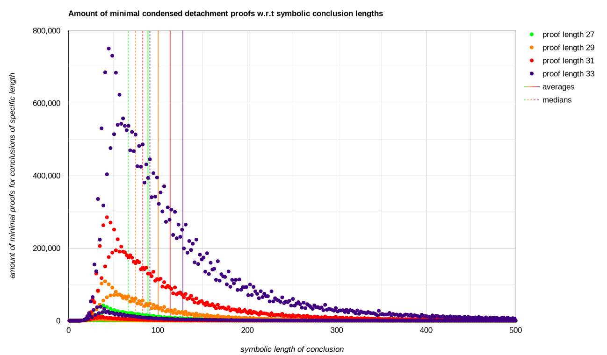
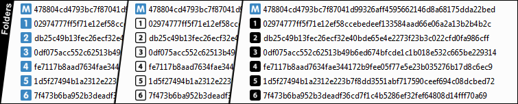
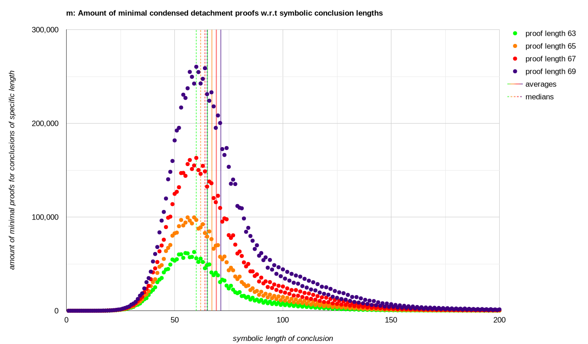
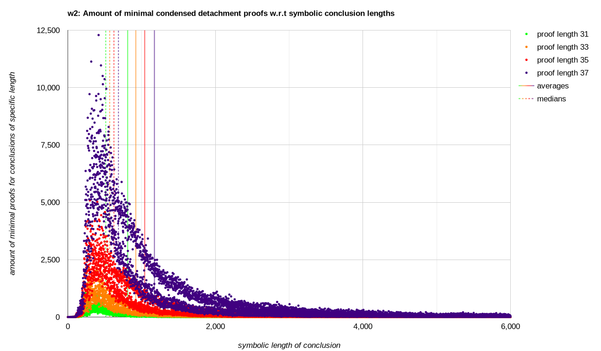
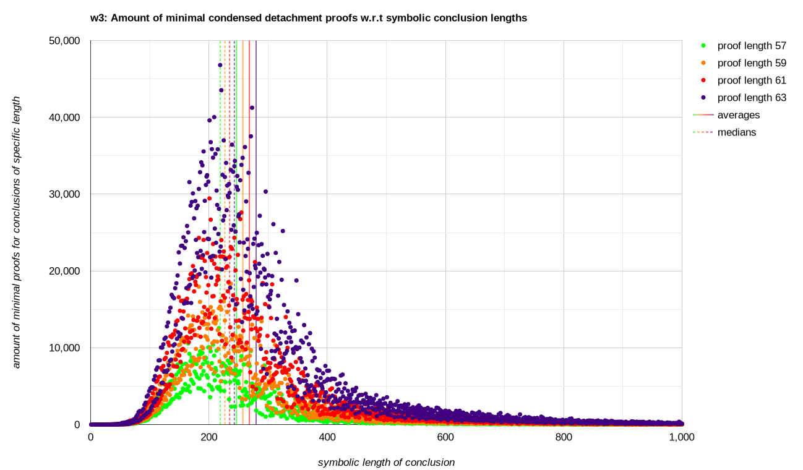
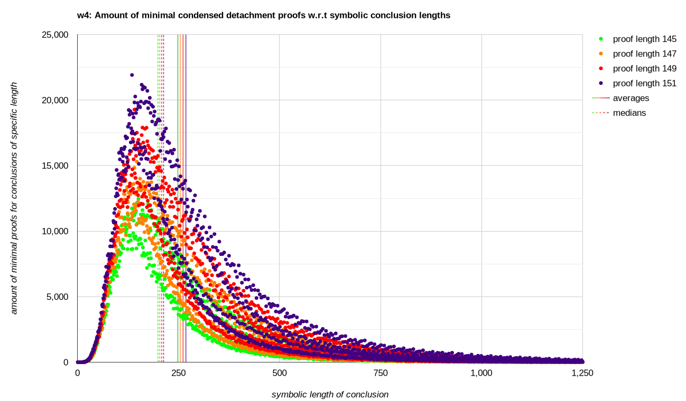
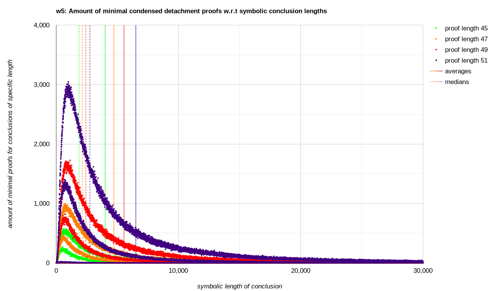
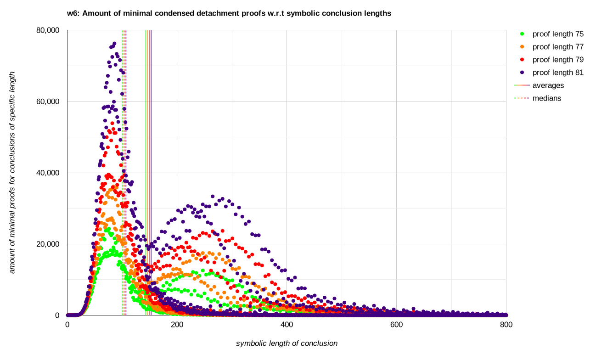
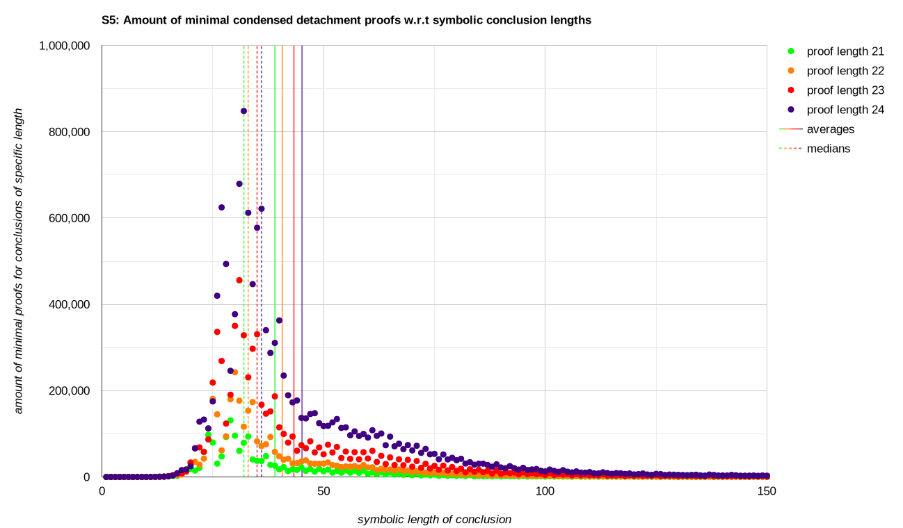

# @xamidi/pmGenerator
 

<h4 id="contents">Contents</h4> <picture></picture>

1. [Introduction](#introduction)
   1. [Frege's calculus simplified by Łukasiewicz `(CpCqp,CCpCqrCCpqCpr,CCNpNqCqp)`](#freges-calculus-simplified-by-łukasiewicz-cpcqpccpcqrccpqcprccnpnqcqp-top1000-cardinalities-db-customization-info)
2. [Navigation](#navigation)
3. [Usage](#usage)
   1. [Commands](#commands)
   2. [Examples](#examples)
4. [Multi-node Computing](#multi-node-computing)
5. [Custom Proof Systems](#custom-proof-systems)
   1. [Meredith's Axiom; 1-basis `(CCCCCpqCNrNsrtCCtpCsp)`](#merediths-axiom-1-basis-cccccpqcnrnsrtcctpcsp-top1000-cardinalities-sample-info)
   2. [Walsh's 1st Axiom; 1-basis `(CCpCCNpqrCsCCNtCrtCpt)`](#walshs-1st-axiom-1-basis-ccpccnpqrcsccntcrtcpt-top1000-cardinalities-sample-info)
   3. [Walsh's 2nd Axiom; 1-basis `(CpCCqCprCCNrCCNstqCsr)`](#walshs-2nd-axiom-1-basis-cpccqcprccnrccnstqcsr-top1000-cardinalities-sample-info)
   4. [Walsh's 3rd Axiom; 1-basis `(CpCCNqCCNrsCptCCtqCrq)`](#walshs-3rd-axiom-1-basis-cpccnqccnrscptcctqcrq-top1000-cardinalities-sample-info)
   5. [Walsh's 4th Axiom; 1-basis `(CpCCNqCCNrsCtqCCrtCrq)`](#walshs-4th-axiom-1-basis-cpccnqccnrsctqccrtcrq-top1000-cardinalities-sample-info)
   6. [Walsh's 5th Axiom; 1-basis `(CCpqCCCrCstCqCNsNpCps)`](#walshs-5th-axiom-1-basis-ccpqcccrcstcqcnsnpcps-top1000-cardinalities-sample-info)
   7. [Walsh's 6th Axiom; 1-basis `(CCCpqCCCNrNsrtCCtpCsp)`](#walshs-6th-axiom-1-basis-cccpqcccnrnsrtcctpcsp-top1000-cardinalities-sample-info)
   8. [S5 `(CpCqp,CCpCqrCCpqCpr,CCNpNqCqp,CLpp,CLCpqCLpLq,CNLNpLNLNp)`](#s5-cpcqpccpcqrccpqcprccnpnqcqpclppclcpqclplqcnlnplnlnp-top1000-cardinalities-db-sample-info)
6. [Footnotes](#footnotes)

#### Introduction
This tool can collect exhaustive sets of [condensed detachment](https://en.wikipedia.org/wiki/Condensed_detachment) proofs in D-N-notation and has various functions to display, analyze and utilize them. It can, for example, be used to generate improved versions of Metamath's [“Shortest known proofs of the propositional calculus theorems from Principia Mathematica”](https://us.metamath.org/mmsolitaire/pmproofs.txt "us.metamath.org/mmsolitaire/pmproofs.txt") collection.  
The D-rule combines [unification](https://en.wikipedia.org/wiki/Unification_(computer_science)) with [modus ponens](https://en.wikipedia.org/wiki/Modus_ponens) (⊢p,⊢Cpq ⇒ ⊢q), and there is an option to enable the N-rule (rule of necessitation; ⊢p ⇒ ⊢Lp), thus *pmGenerator* covers all [syntactic consequences](https://en.wikipedia.org/wiki/Logical_consequence#Syntactic_consequence) within [Hilbert systems](https://en.wikipedia.org/wiki/Hilbert_system) based on modus ponens and necessitation, each with a minimal proof, limited only by computing power.  
There is a [discussion forum](https://github.com/xamidi/pmGenerator/discussions) for questions, ideas, challenges, and related information.

Eligible for high-performance computing. If you have access to a powerful computer, you may use *pmGenerator* to further contribute to our knowledge regarding the [complexity of proof systems](https://en.wikipedia.org/wiki/Proof_complexity). Progress that has already been made is exemplarily shown below.

###### Frege's calculus simplified by Łukasiewicz ([CpCqp](svg/frege-1.svg),[CCpCqrCCpqCpr](svg/frege-2.svg),[CCNpNqCqp](svg/lukasiewicz-3.svg)) &nbsp;[[top1000](data/top1000SmallestConclusions_1to39Steps.txt)] [[cardinalities](data/cardinalities.txt)] [[db](https://us.metamath.org/mmsolitaire/pmproofs.txt)] [[customization info](data/52436f9e87daeb2c361a73a9f389b061258328e641f750b1767addf7/!.def)]

Behavioral Graph✻ <picture></picture> &nbsp;[<a href="svg/plot/default-bgraph_grayscale.svg">grayscale</a>] [<a href="data/plot/default-plot_data_x500.txt">raw</a>]

Data <picture></picture>

|                                                                                                             Files up to..                                                                                                              |           Paths           | &nbsp; Size of Files    [B]         &nbsp; |       +Costs&nbsp;&nbsp; [≈core&#x2011;h]        |  RAM&nbsp;(load) [≈GiB]   &nbsp;  |  RAM&nbsp;(gen.) [≈GiB]   &nbsp;  |                                                                Recent&nbsp; Growth                                                                |
| -------------------------------------------------------------------------------------------------------------------------------------------------------------------------------------------------------------------------------------- |:-------------------------:| ---------------------------------------------:| ---------------------------------------------------:| ------------------------------------:| ------------------------------------:| ----------------------------------------------------------------------------------------------------------------------------------------------------:|
| [dProofs29.txt](https://github.com/xamidi/pmGenerator/tree/master/data/dProofs-withConclusions "735'676'962 bytes compressed into 41'959'698 bytes (ratio approx. 17.5329)")                                     |  |                                   735 676 962 |   [1276.72](log/dProofs29_6node_288cpu.log)         |    [2.16](log/utilization/29.log)    |    [3.22](log/jobsRSS.txt#L1-L9)     | [3.3613...](https://www.wolframalpha.com/input?i=516720692%2F153725015 "size(dProofs29.txt) / size(dProofs27.txt)")                                  |
| [dProofs31&#x2011;unfiltered31+.txt](https://mega.nz/file/G18AWIpC#B04xOdtQj_2PJJP0yNQxbim7pOgd-hwv1i1EVU6ZsTM "2'161'632'450 bytes compressed into 112'364'583 bytes (ratio approx. 19.2377)")                  |  |                                 2 897 309 412 |     [23.19](log/dProofs31-unfiltered31+_48cpu.log)  |    [5.78](log/utilization/31-31.log) |   [12.54](log/jobsRSS.txt#L11-L18)   | [4.1833...](https://www.wolframalpha.com/input?i=2161632450%2F516720692 "size(dProofs31-unfiltered31+.txt) / size(dProofs29.txt)")                   |
| [dProofs31.txt](https://mega.nz/file/P1ki0IKQ#mb0QCboSu0Ofgr9nxspZTdcGUaAHPLzt-rQ8y0TN27k "1'741'338'664 bytes compressed into 89'327'496 bytes (ratio approx. 19.4939)")❈                            |  |                                 2 477 015 626 |  [12681.68](log/dProofs31_6node_288cpu.log)         |    [5.00](log/utilization/31.log)    |   [12.51](log/jobsRSS.txt#L20-L28)   | [3.3699...](https://www.wolframalpha.com/input?i=1741338664%2F516720692 "size(dProofs31.txt) / size(dProofs29.txt)")                                 |
| [dProofs33&#x2011;unfiltered31+.txt](https://mega.nz/file/3gVQSIJL#Qfa9CoUwsHWYYNHXYaP1mg61QQSJ1NSl1CHudK4g7BA "8'349'023'875 bytes compressed into 402'886'507 bytes (ratio approx. 20.7230)")                  |  |                                11 246 333 287 |     [86.59](log/dProofs33-unfiltered31+_48cpu.log)  |   [19.49](log/utilization/33-31.log) |   [43.73](log/jobsRSS.txt#L30-L37)   | [3.8623...](https://www.wolframalpha.com/input?i=8349023875%2F2161632450 "size(dProofs33-unfiltered31+.txt) / size(dProofs31-unfiltered31+.txt)")    |
| [dProofs33&#x2011;unfiltered33+.txt](https://mega.nz/file/ixshHB7S#ktigbEzeOvCvFP8pruhC0NFfeK91p__eS_uZxBtIy0w "7'295'621'951 bytes compressed into 352'588'174 bytes (ratio approx. 20.6916)")                  |  |                                10 192 931 363 |     [92.19](log/dProofs33-unfiltered33+_48cpu.log)  |   [17.04](log/utilization/33-33.log) |   [39.42](log/jobsRSS.txt#L39-L46)   | [4.1896...](https://www.wolframalpha.com/input?i=7295621951%2F1741338664 "size(dProofs33-unfiltered33+.txt) / size(dProofs31.txt)")                  |
| [dProofs33.txt](https://mega.nz/file/S5tDkSCC#WKEWeT7Niaj9ZVWrqiy-FGPI8ACGsd2H7mA3ZWUITFY "5'876'664'090 bytes compressed into 279'929'404 bytes (ratio approx. 20.9934)")❈                           |  |                                 8 353 679 716 | [110356.00](log/dProofs33_60node_2880cpu.log)       |   [14.67](log/utilization/33.log)    |   [39.20](log/jobsRSS.txt#L48-L56)   | [3.3747...](https://www.wolframalpha.com/input?i=5876664090%2F1741338664 "size(dProofs33.txt) / size(dProofs31.txt)")                                |
| [dProofs35&#x2011;unfiltered31+.txt](https://mega.nz/file/2893yZ7S#JlCHv4uOajgBJPPE2W87F_LAPzkH0-FlF4_2OrccuC4 "30'717'801'573 bytes compressed into 1'400'853'331 bytes (ratio approx. 21.9279)")               |  |                                41 964 134 860 |    [366.69](log/dProofs35-unfiltered31+_48cpu.log)  |   [67.74](log/utilization/35-31.log) |  [154.60](log/jobsRSS.txt#L58-L65)   | [3.6792...](https://www.wolframalpha.com/input?i=30717801573%2F8349023875 "size(dProofs35-unfiltered31+.txt) / size(dProofs33-unfiltered31+.txt)")   |
| [dProofs35&#x2011;unfiltered33+.txt](https://mega.nz/file/WwNViKRa#UBiPOFN4wRkMgetY60eAQi1oXVQ3fQdkcg7hFxB-Dfk "28'223'320'428 bytes compressed into 1'290'589'236 bytes (ratio approx. 21.8686)")               |  |                                38 416 251 791 |    [329.08](log/dProofs35-unfiltered33+_48cpu.log)  |   [61.41](log/utilization/35-33.log) |  [137.87](log/jobsRSS.txt#L67-L74)   | [3.8685...](https://www.wolframalpha.com/input?i=28223320428%2F7295621951 "size(dProofs35-unfiltered33+.txt) / size(dProofs33-unfiltered33+.txt)")   |
| [dProofs35&#x2011;unfiltered35+.txt](https://mega.nz/file/b0t1xbKI#6sjAICTTNMfQ2VO5kyVMpxVHSQNZzxWPktOEGJkberk "24'669'947'024 bytes compressed into 1'121'466'816 bytes (ratio approx. 21.9979)")               |  |                                33 023 626 740 |    [307.16](log/dProofs35-unfiltered35+_48cpu.log)  |   [53.49](log/utilization/35-35.log) |  [124.14](log/jobsRSS.txt#L76-L83)   | [4.1979...](https://www.wolframalpha.com/input?i=24669947024%2F5876664090 "size(dProofs35-unfiltered35+.txt) / size(dProofs33.txt)")                 |
| [dProofs37&#x2011;unfiltered31+.txt](https://mega.nz/file/6wUyDQzT#DQIJOLd5dCn-6V9sJWiJXeGRPUTUaA-7LqbGfLStjV0 "113'174'356'461 bytes compressed into 4'897'020'927 bytes (ratio approx. 23.1109)")❈  |  |                               155 138 491 321 |  [18975.40](log/dProofs37-unfiltered31+_144cpu.log) |  [238.30](log/utilization/37-31.log) |  [485.12](log/jobsRSS.txt#L85-L92)   | [3.6843...](https://www.wolframalpha.com/input?i=113174356461%2F30717801573 "size(dProofs37-unfiltered31+.txt) / size(dProofs35-unfiltered31+.txt)") |
| [dProofs37&#x2011;unfiltered33+.txt](https://mega.nz/file/q1txWSZA#P_HoU6_4_fCYd_1Zw7Y5UG7R4UWdlVm4_s9xG6pzsoY "103'965'043'304 bytes compressed into 4'479'575'346 bytes (ratio approx. 23.2087)")❈  |  |                               142 381 295 095 |  [14331.28](log/dProofs37-unfiltered33+_144cpu.log) |  [217.76](log/utilization/37-33.log) |  [446.50](log/jobsRSS.txt#L94-L101)  | [3.6836...](https://www.wolframalpha.com/input?i=103965043304%2F28223320428 "size(dProofs37-unfiltered33+.txt) / size(dProofs35-unfiltered33+.txt)") |
| [dProofs37&#x2011;unfiltered35+.txt](https://mega.nz/file/Pg0STDYL#YZF0i4i6AcLP2_gZQuHNb40ajbspYC8wOFsK7fmKQTw "95'571'571'048 bytes compressed into 4'105'722'124 bytes (ratio approx. 23.2777)")❈   |  |                               128 595 197 788 |  [14740.88](log/dProofs37-unfiltered35+_144cpu.log) |  [197.08](log/utilization/37-35.log) |  [408.38](log/jobsRSS.txt#L103-L110) | [3.8740...](https://www.wolframalpha.com/input?i=95571571048%2F24669947024 "size(dProofs37-unfiltered35+.txt) / size(dProofs35-unfiltered35+.txt)")  |
| [dProofs39&#x2011;unfiltered35+.txt](https://mega.nz/file/WwEgwITB#Fk145eaRsw7S3IFpuxwcbeyYi4IwNatrxF7SWnZwvIo "352'398'833'029 bytes compressed into 14'265'852'732 bytes (ratio approx. 24.7023)")❈ |  |                               480 994 030 817 |   [4566.99](log/dProofs39-unfiltered35+_64cpu.log)  | [1301.97](log/utilization/39-35.log) | [1768.07](log/jobsRSS.txt#L112-L119) | [3.6872...](https://www.wolframalpha.com/input?i=352398833029%2F95571571048 "size(dProofs39-unfiltered35+.txt) / size(dProofs37-unfiltered35+.txt)") |

Measured RAM requirements correspond to the maximum resident set size according to [Slurm](https://slurm.schedmd.com/documentation.html), i.e. `MaxRSS` of [sacct](https://slurm.schedmd.com/sacct.html).  
Required resources vary based on implementation and environment; numbers are to illustrate orders of magnitude.  
Some more – and very special – proof systems are illustrated [further down below](#custom-proof-systems).

#### Navigation
- [C++20 branch](https://github.com/xamidi/pmGenerator/tree/master) (master)
- [C++11 branch](https://github.com/xamidi/pmGenerator/tree/c++11) (version 1.2.0, discontinued)
- [Mirror repository](https://codeberg.org/xamidi/pmGenerator) (on Codeberg.org)

#### Usage
    pmGenerator ( <configuring command> | <composable command> )+ | <configuring command>* <standalone command>

###### Commands
    Configuring:
      -c [-i <file>] [-s <string>] [-n] [-N <limit or -1>] [-l] [-e <id>] [-d]
         Proof system customization ; Generates a SHA-512/224 hash to identify the system, sets the effective data location to "<data location>/<hash>", and (if nonexisting) creates the !.def file.
           -i: specify axioms by input file path (where a LF-separated string of axioms is stored), ignoring lines that are empty or starting with '%'
           -s: specify axioms by comma-separated string ; used only when '-i' unspecified ; default: "C0C1.0,CC0C1.2CC0.1C0.2,CCN0N1C1.0"
           -n: specify formulas in normal Polish notation (e.g. "CpCqp"), not with numeric variables (e.g. "C0C1.0")
           -N: enable necessitation rule "N" for the given system with unlimited (-N -1) or limited (-N <positive amount>) consecutive necessitation steps allowed
           -l: disable lazy N-rule parsing ; parse proofs Nα:Lβ despite knowing α:β (requires more time but less memory)
           -e: specify extracted system with the given identifier
           -d: default system ; ignore all other arguments except '-e'

    Composable:
      -g <limit or -1> [-u] [-q <limit or -1>] [-l <limit or -1>] [-k <limit or -1>] [-b] [-f] [-s]
         Generate proof files ; at ./data/[<hash>/]/dProofs-withConclusions/ when '-s' unspecified ; otherwise at ./data/[<hash>/]/dProofs-withoutConclusions/
           -u: unfiltered (significantly faster, but generates redundant proofs)
           -q: limit number of proof candidate strings queued per worker thread (may lower memory requirements for systems with low acceptance rates) ; default: 50
           -l: limit symbolic length of generated conclusions to at most the given number ; works only in extracted environments ; recommended to use in combination with '-q' to save memory
           -k: similar to '-l' ; limit symbolic length of consequents in generated conclusions, i.e. antecedents in conditionals are not limited (but non-conditionals are limited in full length)
           -b: brief parsing ; append conclusion structures to D-proof processing and use them for rule evaluation (collects faster, but requires significantly more memory)
           -f: full parsing ; parse entire D-proofs rather than using conclusion strings for rule evaluation ; used only when '-b' unspecified
           -s: proof files without conclusions, requires additional parsing ; entails '-f' ; used only when '-b' unspecified
      -r <D-proof database> <output file> [-l <path>] [-i <prefix>] [-s] [-d]
         Replacements file creation based on proof files
           -l: customize data location path ; default: "data"
           -i: customize input file path prefix in data location ; default: "dProofs-withConclusions/dProofs"
           -s: proof files without conclusions, requires additional parsing ; sets default input file path prefix to "dProofs-withoutConclusions/dProofs"
           -d: print debug information
      -a <initials> <replacements file> <D-proof database> <output file> [-s] [-l] [-w] [-d]
         Apply replacements file
           -s: style all proofs (replace proofs with alphanumerically smaller variants)
           -l: list all proofs (i.e. not only modified proofs)
           -w: wrap results
           -d: print debug information
      --parse <string> [-n] [-u] [-j <limit or -1>] [-b] [-s] [-e] [-f] [-o <output file>] [-d]
         Parse and print proofs given by a comma-separated string
           -n: print formulas in normal Polish notation (e.g. "CpCqp"), not with numeric variables (e.g. "C0C1.0")
           -u: print formulas in infix notation with operators as Unicode characters ; used only when '-n' unspecified
           -j: join common subproofs together when they are used at least a given amount of times ; default: 2
           -b: only print conclusions of the given proofs ; sets default of '-j' to 1
           -s: only print summary with conclusions and abstract condensed detachment proofs ; used only when '-b' unspecified
           -e: keep expanded proof strings ; show fully detailed condensed detachment proofs rather than allowing them to contain references ; used only when '-b' unspecified
           -f: proofs are given by input file path (where a comma-separated string is stored), ignoring all CR, LF, whitespace, and lines starting with '%'
           -o: redirect the result's output to the specified file
           -d: print debug information
      --transform <string> [-s <string>] [-j <limit or -1>] [-p <limit or -1>] [-n] [-u] [-t <string>] [-e] [-i <limit or -1>] [-l <limit or -1>] [-b] [-w] [-z] [-x <limit>] [-y] [-k] [-v <file>] [-h] [-q] [-f] [-o <output file>] [-d]
         Transform proof summary (as by '--parse [...] -s') into recombined variant ; ignores configured system (proof summaries provide their own axioms) ; "," represents LF
           -s: list a subproof with its conclusion if it occurs in the given comma-separated list of conclusions
           -j: join common subproofs together when they are used at least a given amount of times ; default: 2
           -p: only keep subproofs with primitive lengths not exceeding the given limit ; default: -1
           -n: specify and print formulas in normal Polish notation (e.g. "CpCqp"), not with numeric variables (e.g. "C0C1.0")
           -u: print formulas in infix notation with operators as Unicode characters ; does not affect input format (for which '-n' can still be specified)
           -t: only transform proofs of specified theorems (proven by subsequences of the input), given by a comma-separated string ; '-t .': all given conclusions ; '-t _': all used conclusions ; default: final theorem only
           -e: keep expanded proof strings ; show fully detailed condensed detachment proofs rather than allowing them to contain references
           -i: decrease memory requirements but increase time consumption by not storing intermediate unfoldings that exceed a certain length ; default: -1
           -l: abort computation when combined requested proof sequences exceed the given limit in bytes ; default: 134217728 (i.e. 128 MiB)
           -b: duplicate conclusion removal ; replace each given subproof that has a redundant conclusion with its first shortest alternative and remove duplicates ; beneficial in preparing '-z'
           -w: read input without conclusions given
           -z: proof compression ; find and remove internal redundancies (e.g. non-trivial parts not affecting intermediate theorems) by attempting to use shorter owned subproofs at all positions
           -x: proof compression with extended modification range; before each round generate relative abstract proofs (D-rules only) with up to <range> steps, potentially improving rules with new formulas ; default: 0
           -y: disable multi-threaded D-rule replacement search in case proof compression is performed (enables deterministic procedure) ; not affecting exhaustive generations via '-x', which remain nondeterministic
           -k: store maximum-size proofs generated via 'x' also when they do not prove known intermediate theorems, so they can still be used as replacements for subproofs ; increases memory consumption significantly
           -v: coordinate iteration phases for maximum-size proofs generated via 'x' with the specified vault file (to avoid repeating these computations over multiple runs) ; used only when '-k' unspecified
           -h: save raw intermediate results in files before each proof compression round (and after productive rounds) ; after each preparation phase (exhaustive generation) in case '-x' is specified
           -q: skip first round preparation for '-x' ; useful to continue working on intermediate results produced by an aborted computation using '-h'
           -f: proof summary is given by input file path ; ignores lines that are empty or starting with '%'
           -o: redirect the result's output to the specified file
           -d: print debug information
      --unfold <string> [-n] [-t <string>] [-i <limit or -1>] [-l <limit or -1>] [-w] [-v] [-f] [-o <output file>] [-d]
         Break down proof summary (as by '--parse [...] -s') into primitive steps ; ignores configured system (proof summaries provide their own axioms) ; "," represents LF
           -n: specify formulas in normal Polish notation (e.g. "CpCqp"), not with numeric variables (e.g. "C0C1.0")
           -t: obtain proofs of specified theorems (proven by subsequences of the input), given by a comma-separated string ; '-t .': all given conclusions ; '-t _': all used conclusions ; default: final theorem only
           -i: decrease memory requirements but increase time consumption by not storing intermediate unfoldings that exceed a certain length ; default: -1
           -l: abort computation when combined requested proof sequences exceed the given limit in bytes ; default: 134217728 (i.e. 128 MiB)
           -w: wrap results
           -v: read input without conclusions given
           -f: proof summary is given by input file path ; ignores lines that are empty or starting with '%'
           -o: redirect the result's output to the specified file
           -d: print debug information
      --search <string> [-n] [-s] [-w] [-t] [-p] [-f] [-d]
         Search in proof files at ./data/[<hash>/]/dProofs-withConclusions/ via comma-separated string of full formulas or full proofs ; [Hint: Generate missing files with '--variate 1 -s'.]
           -n: specify formulas in normal Polish notation (e.g. "CpCqp"), not with numeric variables (e.g. "C0C1.0")
           -s: search for schemas of the given formulas
           -w: search whole collections of schemas (i.e. enable multiple results per term) ; entails '-s'
           -t: search for formulas of the given schemas (allows multiple results per term) ; used only when '-s' and '-w' unspecified
           -p: search proofs (rather than conclusions) ; used only when '-n', '-s', '-w' and '-t' unspecified
           -f: search terms are given by input file path (where a comma-separated string is stored), ignoring all CR, LF, whitespace, and lines starting with '%'
           -d: print debug information
      --extract [-t <limit or -1>] [-o <output file>] [-s] [-z] [-# <amount up to 35>] [-h <string>] [-l <limit or -1>] [-k <limit or -1>] [-f] [-d]
         Various options to extract information from proof files ; [Hint: Generate missing files with '--variate 1 -s'.]
           -t: compose file with up to the given amount of smallest conclusions that occur in proof files ; includes origins, symbolic lengths, proofs, and formulas in normal Polish notation
           -o: specify output file path for '-t' ; relative to effective data location ; default: "top<amount>SmallestConclusions_<min proof length>to<max proof length>Steps<unfiltered info>.txt"
           -s: redundant schema removal for '-t' ; very time-intensive for requesting huge collections from unfiltered proof files - better pre-filter via '-g' or '-m' instead ; default: false
           -z: force redundant schema removal for '-t' ; like '-s', but also filter proof files not declared as unfiltered (which might be useful for non-standard procedures)
           -#: initialize proof system at ./data/[<hash>/]/extraction-<id>/ with the given amount of smallest filtered conclusions that occur in proof files ; specify with '-c <parent system> -e <id>'
           -h: similar to '-#' ; hand-pick conclusions with a comma-separated string of proofs ; "." to not modify axioms
           -l: similar to '-#' (but creates identical system with prebuilt proof files) ; copy proofs with conclusions that have symbolic lengths of at most the given number
           -k: similar to '-l' ; copy proofs with conclusions that have consequents or are non-conditionals of symbolic lengths of at most the given number ; can be combined with '-l'
           -f: proofs for '-h' are given by input file path (where a comma-separated string is stored), ignoring all CR, LF, whitespace, and lines starting with '%'
           -d: print debug information
      --assess [-u] [-s] [-d]
         Print proof file cardinalities, numbers of proof candidates for all generation steps up to the next one, and all stored and estimated next removal amounts (to assess generation expenditures)
           -u: use unfiltered proof files
           -s: use proof files without conclusions
           -d: print debug information
      --iterate [-u] [-s]
         Iterate proof candidates currently next up for generation and print their amount (for resource consumption measurements)
           -u: use unfiltered proof files
           -s: use proof files without conclusions
      --variate ( 0 | 1 ) [-l <path>] [-i <prefix>] [-o <prefix>] [-s] [-d]
         Create proof files with removed (--variate 0) or added (--variate 1) conclusions from in-memory data and proof files of the other variant
           -l: customize data location path ; default: "data"
           -i: customize input file path prefix in data location ; default: "dProofs-withConclusions/dProofs" or "dProofs-withoutConclusions/dProofs"
           -o: customize output file path prefix in data location ; default: "dProofs-withoutConclusions/dProofs" or "dProofs-withConclusions/dProofs"
           -s: only use data stored in-memory
           -d: print debug information
      --plot [-l <path>] [-i <prefix>] [-s] [-t] [-x <limit or -1>] [-y <limit or -1>] [-o <output file>] [-d]
         Print conclusion length plot data
           -l: customize data location path ; default: "data"
           -i: customize input file path prefix in data location ; requires files with conclusions ; default: "dProofs-withConclusions/dProofs"
           -s: measure symbolic length (in contrast to conclusion representation length)
           -u: include unfiltered proof files
           -t: table arrangement, one data point per row
           -x: upper horizontal limit
           -y: upper vertical limit
           -o: print to given output file
           -d: print debug information

    Standalone:
      -m <limit> [-s]
         MPI-based multi-node filtering (-m <n>) of a first unfiltered proof file (with conclusions) at ./data/[<hash>/]dProofs-withConclusions/dProofs<n>-unfiltered<n>+.txt. Creates dProofs<n>.txt.
           -s: disable smooth progress mode (lowers memory requirements, but makes terrible progress predictions)

###### Examples
    pmGenerator -g -1 -q 50
    pmGenerator -g 19 -g 21 -u -r data/pmproofs-old.txt data/pmproofs-reducer.txt -d -a SD data/pmproofs-reducer.txt data/pmproofs-old.txt data/pmproofs-result-styleAll-modifiedOnly.txt -s -w -d
    pmGenerator --variate 0 -l data/ -o "dProofs-withoutConclusions (all)/dProofs" -d
    pmGenerator --variate 1 -s --search CNpCCNpqNp -n -d --search CNpCCNpqNp -n -s
    pmGenerator --variate 1 -s --search CCNpCpqCNpCpq,CCCCppCppCCCppCppCNCCqqCqqCCCqqCqqCCqqCqqCCCppCppCNCCqqCqqCCCqqCqqCCqqCqq -n -w -d
    pmGenerator --plot -s -d --plot -s -t -x 50 -y 100 -o data/plot_data_x50_y100.txt
    pmGenerator -c -N -1 -n -s CpCqp,CCpCqrCCpqCpr,CCNpNqCqp,CLpp,CLCpqCLpLq,CNLNpLNLNp --parse DD2D16DD2DD2D13DD2D1D2DD2D1D2D1DD2DD2D13D1DD2DD2D13DD2D13114DD2D13DD2D1311D3DD2DD2D13DD2D1311 -j 2 -n
    pmGenerator --parse DD2D11DD2D13DD2D1DD22D11DD2D11DD2D131 -n -s -o data/CNCpNqCrCsq.txt --transform data/CNCpNqCrCsq.txt -f -n -j 1 -e --transform data/CNCpNqCrCsq.txt -f -n -t CNCpNqCrq -d
    pmGenerator --unfold CpCqp=1,CCpCqrCCpqCpr=2,CCNpNqCqp=3,[0]CCpCNqNrCpCrq:D2D13,[1]Cpp:DD211,[2]NCCppNCqq:DD3DD2DD2D[0]D[0]11D1[1][1] -n -t CNNpp,NCCppNCqq
    pmGenerator --transform data/m.txt -f -n -t CpCqp,CCpCqrCCpqCpr,CCNpNqCqp,Cpp,CCpqCCqrCpr,CCNppp,CpCNpq -j -1 -p -2 -d
    pmGenerator --transform "CCCpqrCCrpCsp=1,[0]=DDDD1D1D1D1DDDD1D1D11111111,[1]=D1DD[0]1[0],[2]=DDDD1DD[1][1]1111" -n -w -t _
    pmGenerator -c -s CCCCC0.1CN2N3.2.4CC4.0C3.0 -g 35 --plot -s -t -x 50 -y 100 -o data/478804cd4793bc7f87041d99326aff4595662146d8a68175dda22bed/plot_data_x50_y100.txt
    pmGenerator -c -n -s CCCCCpqCNrNsrtCCtpCsp --search CpCqp,CCpCqrCCpqCpr,CCNpNqCqp -n
    pmGenerator --variate 1 -s --extract -t 1000 -s -d
    pmGenerator --variate 1 -s --extract -# 35 -d -c -d -e 0
    pmGenerator -m 17 -s

#### Multi-node Computing
For MPI-based filtering, each spawned process is multi-threaded and attempts to use as many threads as the hardware specifies as concurrent. Therefore, it is ideal to spawn the same amount of processes and nodes.  
The following exemplary [Slurm](https://slurm.schedmd.com/documentation.html) batch script has been used via [sbatch](https://slurm.schedmd.com/sbatch.html) in order to reduce `dProofs31‑unfiltered31+.txt` to `dProofs31.txt`.

    #!/bin/zsh
    #SBATCH --job-name=pmGen-20
    #SBATCH --output=output_%J.txt
    #SBATCH --partition=c18m
    #SBATCH --account=rwth1392
    #SBATCH --time=3-00:00:00
    #SBATCH --mem-per-cpu=3900M
    #SBATCH --cpus-per-task=48
    #SBATCH --mail-user=<email>
    #SBATCH --mail-type=END,FAIL,TIME_LIMIT
    ## Number of nodes to use ; Also update #processes (via srun)!
    #SBATCH --nodes=6
    srun -n 6 ./pmGenerator -m 31

A subsequent query with [squeue](https://slurm.schedmd.com/squeue.html) would then reveal the following information:

    $ squeue -o "%.9i %.8j %.9P %.11a %.8u %.5C %.5D %.10T %.10M %.10l %.19S %R" -u <userID>
        JOBID     NAME PARTITION     ACCOUNT     USER  CPUS NODES      STATE       TIME TIME_LIMIT          START_TIME NODELIST(REASON)
     34762453 pmGen-20      c18m    rwth1392 <userID>   288     6    RUNNING       3:34 3-00:00:00 2023-05-04T07:52:24 ncm[0297,0306-0307,0315,0320-0321]

You may have a look at the [log file](log/dProofs31_6node_288cpu.log) generated by that computation.

#### Custom Proof Systems
There are illustrated seven proof systems in the following which according to [M. Walsh and B. Fitelson](http://fitelson.org/walsh.pdf) are minimal 1-bases (i.e. generators consisting of shortest single axioms) for propositional logic.
Their only remaining candidate CCCpqCCrNsCtNtCCtpCrp can be refuted since `pmGenerator -c -n -s CCCpqCCrNsCtNtCCtpCrp -g -1` produces only 9 more representatives (1.`D11:CCpCNpqCrCNpq`, 2.`D1D11:CCNppCqp`, 3.`D1D1D11:CCpNCpNpCqNCpNp`, 4.`DD11D11:CpCNCqCNqrCNqr`, 5.`DD11D1D11:CpCNCNqqq`, 6.`DDD11D111:CNCpCNpqCNpq`, 7.`DD11D1D1D11:CpCNCqNCqNqNCqNq`, 8.`DDD11D1D111:CNCNppp`, 9.`DDD11D1D1D111:CNCpNCpNpNCpNp`).  
Therefore, these systems are implied to be the only minimal 1-bases for C-N propositional calculus.

Target files are distinguished using a hexadecimal SHA-512/224 digest as a folder name for each proof system.  
For user identification of hash folders, I recommend to use custom icons, such as illustrated below.  
&nbsp;&nbsp;  
For this purpose, a favicon database (`ico.dll`) is included in the release files, as well as an archive (`ico.7z`) with all the `.ico` files for usability with non-Windows operating systems.

###### Meredith's Axiom; 1-basis ([CCCCCpqCNrNsrtCCtpCsp](svg/meredith.svg)) &nbsp;[[top1000](data/478804cd4793bc7f87041d99326aff4595662146d8a68175dda22bed/top1000SmallestConclusions_1to83Steps.txt)] [[cardinalities](data/478804cd4793bc7f87041d99326aff4595662146d8a68175dda22bed/cardinalities.txt)] [[sample](data/m.txt)] [[info](data/478804cd4793bc7f87041d99326aff4595662146d8a68175dda22bed/!.def)]

Behavioral Graph✻ <picture></picture> &nbsp;[<a href="svg/plot/m-bgraph_grayscale.svg">grayscale</a>] [<a href="data/plot/m-plot_data_x200.txt">raw</a>]

Data <picture></picture>

|                                                                                                             Files up to..                                                                                                             | &nbsp; Size of Files    [B]         &nbsp; |                         +Costs&nbsp;&nbsp; [≈core&#x2011;h]                          |                     RAM&nbsp;(load) [≈GiB]   &nbsp;                     |                    RAM&nbsp;(gen.) [≈GiB]   &nbsp;                    |                                                                Recent&nbsp; Growth                                                                 |
| ------------------------------------------------------------------------------------------------------------------------------------------------------------------------------------------------------------------------------------- | ---------------------------------------------:| ---------------------------------------------------------------------------------------:| --------------------------------------------------------------------------:| ------------------------------------------------------------------------:| -----------------------------------------------------------------------------------------------------------------------------------------------------:|
| [dProofs67.txt](https://mega.nz/file/XkUgRB4J#iK3tk82M-QdI5dBJbuLgN21PFrHHKDKE9gVYdwaBvz0 "2'422'110'008 bytes compressed into 108'455'851 bytes (ratio approx. 22.3327)")❈                          |                                 2 422 110 008 |  [5500.48](log/custom/meredith-CCCCCpqCNrNsrtCCtpCsp/dProofs67_24node_1152cpu.log)      |    [7.77](log/custom/meredith-CCCCCpqCNrNsrtCCtpCsp/utilization/67.log)    |   [10.00](log/custom/meredith-CCCCCpqCNrNsrtCCtpCsp/jobsRSS.txt#L1-L9)   | [1.6992...](https://www.wolframalpha.com/input?i=996579205%2F586496233 "size(dProofs67.txt) / size(dProofs65.txt)")                                   |
| [dProofs69.txt](https://mega.nz/file/T501SRaY#aAB8wnSt2OEQ7WBPM_ceo44Gwu_ZY28v7g-y_xXWMAg "1'692'424'708 bytes compressed into 70'022'956 bytes (ratio approx. 24.1696)")❈                           |                                 4 114 534 716 | [15432.96](log/custom/meredith-CCCCCpqCNrNsrtCCtpCsp/dProofs69_72node_3456cpu.log)      |   [12.79](log/custom/meredith-CCCCCpqCNrNsrtCCtpCsp/utilization/69.log)    |   [17.07](log/custom/meredith-CCCCCpqCNrNsrtCCtpCsp/jobsRSS.txt#L11-L19) | [1.6982...](https://www.wolframalpha.com/input?i=1692424708%2F996579205 "size(dProofs69.txt) / size(dProofs67.txt)")                                  |
| [dProofs71&#x2011;unfiltered71+.txt](https://mega.nz/file/vgM2VQ6L#9CepsGbebmnqlSdXlgsjL4PmoU8kmcB9vJiBFDCj3XE "4'269'010'294 bytes compressed into 174'601'845 bytes (ratio approx. 24.4500)")                 |                                 8 383 545 010 |   [148.71](log/custom/meredith-CCCCCpqCNrNsrtCCtpCsp/dProofs71-unfiltered71+_48cpu.log) |   [25.06](log/custom/meredith-CCCCCpqCNrNsrtCCtpCsp/utilization/71-71.log) |   [47.19](log/custom/meredith-CCCCCpqCNrNsrtCCtpCsp/jobsRSS.txt#L21-L28) | [2.5224...](https://www.wolframalpha.com/input?i=4269010294%2F1692424708 "size(dProofs71-unfiltered71+.txt) / size(dProofs69.txt)")                   |
| [dProofs73&#x2011;unfiltered71+.txt](https://mega.nz/file/HsUwiaBI#Lr9dg_vkkl5LDniDbhoajaoUf5DMrSuhOLWs7AVtsZo "8'690'446'595 bytes compressed into 350'352'093 bytes (ratio approx. 24.8049)")                 |                                17 073 991 605 |   [254.48](log/custom/meredith-CCCCCpqCNrNsrtCCtpCsp/dProofs73-unfiltered71+_48cpu.log) |   [50.85](log/custom/meredith-CCCCCpqCNrNsrtCCtpCsp/utilization/73-71.log) |   [93.84](log/custom/meredith-CCCCCpqCNrNsrtCCtpCsp/jobsRSS.txt#L30-L37) | [2.0357...](https://www.wolframalpha.com/input?i=8690446595%2F4269010294 "size(dProofs73-unfiltered71+.txt) / size(dProofs71-unfiltered71+.txt)")     |
| [dProofs75&#x2011;unfiltered71+.txt](https://mega.nz/file/G8klVCKA#vrclPrG9dTd7JuyKt3YoBCipmOyJh5WAGXi4A4qQH00 "15'912'038'278 bytes compressed into 627'204'237 bytes (ratio approx. 25.3698)")                |                                32 986 029 883 |   [372.08](log/custom/meredith-CCCCCpqCNrNsrtCCtpCsp/dProofs75-unfiltered71+_48cpu.log) |   [97.22](log/custom/meredith-CCCCCpqCNrNsrtCCtpCsp/utilization/75-71.log) |  [172.29](log/custom/meredith-CCCCCpqCNrNsrtCCtpCsp/jobsRSS.txt#L39-L46) | [1.8309...](https://www.wolframalpha.com/input?i=15912038278%2F8690446595 "size(dProofs75-unfiltered71+.txt) / size(dProofs73-unfiltered71+.txt)")    |
| [dProofs77&#x2011;unfiltered71+.txt](https://mega.nz/file/W00zQRSS#pgCUAfcqdq6MqqaQ5tKLn7CQ_PsclH6_WKELo_FBA4k "29'440'512'597 bytes compressed into 1'137'980'567 bytes (ratio approx. 25.8708)")❈  |                                62 426 542 480 |   [742.28](log/custom/meredith-CCCCCpqCNrNsrtCCtpCsp/dProofs77-unfiltered71+_64cpu.log) |  [181.43](log/custom/meredith-CCCCCpqCNrNsrtCCtpCsp/utilization/77-71.log) |  [304.37](log/custom/meredith-CCCCCpqCNrNsrtCCtpCsp/jobsRSS.txt#L48-L55) | [1.8502...](https://www.wolframalpha.com/input?i=29440512597%2F15912038278 "size(dProofs77-unfiltered71+.txt) / size(dProofs75-unfiltered71+.txt)")   |
| [dProofs79&#x2011;unfiltered71+.txt](https://rwth-aachen.sciebo.de/s/vNC7xWrPSneFbn7                           "56'177'510'817 bytes compressed into 2'123'231'985 bytes (ratio approx. 26.4585)")❈  |                               118 604 053 297 |  [1578.13](log/custom/meredith-CCCCCpqCNrNsrtCCtpCsp/dProofs79-unfiltered71+_64cpu.log) |  [339.19](log/custom/meredith-CCCCCpqCNrNsrtCCtpCsp/utilization/79-71.log) |  [550.39](log/custom/meredith-CCCCCpqCNrNsrtCCtpCsp/jobsRSS.txt#L57-L64) | [1.9081...](https://www.wolframalpha.com/input?i=56177510817%2F29440512597 "size(dProofs79-unfiltered71+.txt) / size(dProofs77-unfiltered71+.txt)")   |
| [dProofs81&#x2011;unfiltered71+.txt](https://rwth-aachen.sciebo.de/s/xiKTUrcNNECfWJ2                           "108'323'290'318 bytes compressed into 4'002'658'331 bytes (ratio approx. 27.0628)")❈ |                               226 927 343 615 |  [2896.16](log/custom/meredith-CCCCCpqCNrNsrtCCtpCsp/dProofs81-unfiltered71+_64cpu.log) |  [635.64](log/custom/meredith-CCCCCpqCNrNsrtCCtpCsp/utilization/81-71.log) | [1003.84](log/custom/meredith-CCCCCpqCNrNsrtCCtpCsp/jobsRSS.txt#L66-L73) | [1.9282...](https://www.wolframalpha.com/input?i=108323290318%2F56177510817 "size(dProofs81-unfiltered71+.txt) / size(dProofs79-unfiltered71+.txt)")  |
| [dProofs83&#x2011;unfiltered71+.txt](https://rwth-aachen.sciebo.de/s/Sy4u4kFrpBvXxYP                           "207'577'506'070 bytes compressed into 7'501'303'661 bytes (ratio approx. 27.6722)")❈ |                               434 504 849 685 |  [5380.80](log/custom/meredith-CCCCCpqCNrNsrtCCtpCsp/dProofs83-unfiltered71+_64cpu.log) | [1196.78](log/custom/meredith-CCCCCpqCNrNsrtCCtpCsp/utilization/83-71.log) | [1846.46](log/custom/meredith-CCCCCpqCNrNsrtCCtpCsp/jobsRSS.txt#L75-L82) | [1.9162...](https://www.wolframalpha.com/input?i=207577506070%2F108323290318 "size(dProofs83-unfiltered71+.txt) / size(dProofs81-unfiltered71+.txt)") |

###### Walsh's 1st Axiom; 1-basis ([CCpCCNpqrCsCCNtCrtCpt](svg/walsh1st.svg)) &nbsp;[[top1000](data/02974777ff5f71e12ef58ccebedeef133584aad66e06a2a13b2b4b2c/top1000SmallestConclusions_1to161Steps.txt)] [[cardinalities](data/02974777ff5f71e12ef58ccebedeef133584aad66e06a2a13b2b4b2c/cardinalities.txt)] [[sample](data/w1.txt)] [[info](data/02974777ff5f71e12ef58ccebedeef133584aad66e06a2a13b2b4b2c/!.def)]

Behavioral Graph✻ <picture></picture> &nbsp;[<a href="svg/plot/w1-bgraph_grayscale.svg">grayscale</a>] [<a href="data/plot/w1-plot_data_x400.txt">raw</a>]

Data <picture></picture>

|                                                                                                              Files up to..                                                                                                              | &nbsp; Size of Files    [B]         &nbsp; |                         +Costs&nbsp;&nbsp; [≈core&#x2011;h]                          |                     RAM&nbsp;(load) [≈GiB]   &nbsp;                     |                    RAM&nbsp;(gen.) [≈GiB]   &nbsp;                    |                                                                  Recent&nbsp; Growth                                                                  |
| --------------------------------------------------------------------------------------------------------------------------------------------------------------------------------------------------------------------------------------- | ---------------------------------------------:| ---------------------------------------------------------------------------------------:| --------------------------------------------------------------------------:| ------------------------------------------------------------------------:| --------------------------------------------------------------------------------------------------------------------------------------------------------:|
| [dProofs137.txt](https://mega.nz/file/utFBXQoL#Om9V_K5VP65ggMDeJJ7L389oXcpFtfaBduNyzCCF_0s "5'371'226'962 bytes compressed into 164'113'739 bytes (ratio approx. 32.7287)")❈                           |                                 5 371 226 962 |  [6707.84](log/custom/walsh1-CCpCCNpqrCsCCNtCrtCpt/dProofs137_48node_2304cpu.log)       |   [14.01](log/custom/walsh1-CCpCCNpqrCsCCNtCrtCpt/utilization/137.log)     |   [20.56](log/custom/walsh1-CCpCCNpqrCsCCNtCrtCpt/jobsRSS.txt#L1-L9)     | [1.2953...](https://www.wolframalpha.com/input?i=1235762264%2F954016122 "size(dProofs137.txt) / size(dProofs135.txt)")                                   |
| [dProofs139.txt](https://mega.nz/file/u0cnxDDJ#2GZAd2TC7bDiNivMBcj6Q20ls8qOottXK-NnGM0XEMM "1'602'917'394 bytes compressed into 46'630'892 bytes (ratio approx. 34.3746)")❈                            |                                 6 974 144 356 | [11663.04](log/custom/walsh1-CCpCCNpqrCsCCNtCrtCpt/dProofs139_72node_3456cpu.log)       |   [18.06](log/custom/walsh1-CCpCCNpqrCsCCNtCrtCpt/utilization/139.log)     |   [25.23](log/custom/walsh1-CCpCCNpqrCsCCNtCrtCpt/jobsRSS.txt#L11-L19)   | [1.2971...](https://www.wolframalpha.com/input?i=1602917394%2F1235762264 "size(dProofs139.txt) / size(dProofs137.txt)")                                  |
| [dProofs141&#x2011;unfiltered141+.txt](https://mega.nz/file/L5sgkQ4J#PfkvYUDrVs-kC_e96LRCWHGulBywbLcTgDGqdrYCPLA "5'160'630'061 bytes compressed into 144'705'625 bytes (ratio approx. 35.6630)")                 |                                12 134 774 417 |   [121.87](log/custom/walsh1-CCpCCNpqrCsCCNtCrtCpt/dProofs141-unfiltered141+_48cpu.log) |   [31.18](log/custom/walsh1-CCpCCNpqrCsCCNtCrtCpt/utilization/141-141.log) |   [53.15](log/custom/walsh1-CCpCCNpqrCsCCNtCrtCpt/jobsRSS.txt#L21-L28)   | [3.2195...](https://www.wolframalpha.com/input?i=5160630061%2F1602917394 "size(dProofs141-unfiltered141+.txt) / size(dProofs139.txt)")                   |
| [dProofs143&#x2011;unfiltered141+.txt](https://mega.nz/file/v8ckRSTT#oqzUYIBn7JpCVuIWucRWnrDHd3QR8zcY3nkcAxvBqXk "8'473'778'240 bytes compressed into 236'694'201 bytes (ratio approx. 35.8005)")                 |                                20 608 552 657 |   [167.89](log/custom/walsh1-CCpCCNpqrCsCCNtCrtCpt/dProofs143-unfiltered141+_48cpu.log) |   [52.28](log/custom/walsh1-CCpCCNpqrCsCCNtCrtCpt/utilization/143-141.log) |   [83.02](log/custom/walsh1-CCpCCNpqrCsCCNtCrtCpt/jobsRSS.txt#L30-L37)   | [1.6420...](https://www.wolframalpha.com/input?i=8473778240%2F5160630061 "size(dProofs143-unfiltered141+.txt) / size(dProofs141-unfiltered141+.txt)")    |
| [dProofs145&#x2011;unfiltered141+.txt](https://mega.nz/file/uwlhXCZL#WOjPacTW0IOP4Faw5Y5PcnQMsjEPkf36lXcMvZpgfDo "12'166'973'212 bytes compressed into 335'810'389 bytes (ratio approx. 36.2317)")                |                                32 775 525 869 |   [281.73](log/custom/walsh1-CCpCCNpqrCsCCNtCrtCpt/dProofs145-unfiltered141+_48cpu.log) |   [82.13](log/custom/walsh1-CCpCCNpqrCsCCNtCrtCpt/utilization/145-141.log) |  [126.35](log/custom/walsh1-CCpCCNpqrCsCCNtCrtCpt/jobsRSS.txt#L39-L46)   | [1.4358...](https://www.wolframalpha.com/input?i=12166973212%2F8473778240 "size(dProofs145-unfiltered141+.txt) / size(dProofs143-unfiltered141+.txt)")   |
| [dProofs147&#x2011;unfiltered141+.txt](https://mega.nz/file/7t0AEZBZ#yJRMROkE6QVRlg2xJx3KK2VWxN2ibSMXBrDF8VC-UQY "16'130'023'412 bytes compressed into 440'582'939 bytes (ratio approx. 36.6106)")❈    |                                48 905 549 281 |   [376.27](log/custom/walsh1-CCpCCNpqrCsCCNtCrtCpt/dProofs147-unfiltered141+_64cpu.log) |  [121.50](log/custom/walsh1-CCpCCNpqrCsCCNtCrtCpt/utilization/147-141.log) |  [185.33](log/custom/walsh1-CCpCCNpqrCsCCNtCrtCpt/jobsRSS.txt#L48-L55)   | [1.3257...](https://www.wolframalpha.com/input?i=16130023412%2F12166973212 "size(dProofs147-unfiltered141+.txt) / size(dProofs145-unfiltered141+.txt)")  |
| [dProofs149&#x2011;unfiltered141+.txt](https://mega.nz/file/yxdCXKwL#SfnM2LGuViJ3lIQQyrXskTu6ObGZuYfOltmYTV4zqNw "21'575'998'815 bytes compressed into 582'486'170 bytes (ratio approx. 37.0412)")❈    |                                70 481 548 096 |   [564.46](log/custom/walsh1-CCpCCNpqrCsCCNtCrtCpt/dProofs149-unfiltered141+_64cpu.log) |  [173.34](log/custom/walsh1-CCpCCNpqrCsCCNtCrtCpt/utilization/149-141.log) |  [264.17](log/custom/walsh1-CCpCCNpqrCsCCNtCrtCpt/jobsRSS.txt#L57-L64)   | [1.3376...](https://www.wolframalpha.com/input?i=21575998815%2F16130023412 "size(dProofs149-unfiltered141+.txt) / size(dProofs147-unfiltered141+.txt)")  |
| [dProofs151&#x2011;unfiltered141+.txt](https://rwth-aachen.sciebo.de/s/kyJbalQmwpsBxIZ                           "29'138'591'117 bytes compressed into 779'973'708 bytes (ratio approx. 37.3584)")❈    |                                99 620 139 213 |   [825.12](log/custom/walsh1-CCpCCNpqrCsCCNtCrtCpt/dProofs151-unfiltered141+_64cpu.log) |  [243.11](log/custom/walsh1-CCpCCNpqrCsCCNtCrtCpt/utilization/151-141.log) |  [371.22](log/custom/walsh1-CCpCCNpqrCsCCNtCrtCpt/jobsRSS.txt#L66-L73)   | [1.3505...](https://www.wolframalpha.com/input?i=29138591117%2F21575998815 "size(dProofs151-unfiltered141+.txt) / size(dProofs149-unfiltered141+.txt)")  |
| [dProofs153&#x2011;unfiltered141+.txt](https://rwth-aachen.sciebo.de/s/n9ccdaAHt2YgyBO                           "39'867'127'446 bytes compressed into 1'058'080'615 bytes (ratio approx. 37.6787)")❈  |                               139 487 266 659 |  [1169.19](log/custom/walsh1-CCpCCNpqrCsCCNtCrtCpt/dProofs153-unfiltered141+_64cpu.log) |  [340.40](log/custom/walsh1-CCpCCNpqrCsCCNtCrtCpt/utilization/153-141.log) |  [520.65](log/custom/walsh1-CCpCCNpqrCsCCNtCrtCpt/jobsRSS.txt#L75-L82)   | [1.3681...](https://www.wolframalpha.com/input?i=39867127446%2F29138591117 "size(dProofs153-unfiltered141+.txt) / size(dProofs151-unfiltered141+.txt)")  |
| [dProofs155&#x2011;unfiltered141+.txt](https://rwth-aachen.sciebo.de/s/iw4tK8bBsjWldVW                           "53'770'763'259 bytes compressed into 1'413'419'788 bytes (ratio approx. 38.0430)")❈  |                               193 258 029 918 |  [1610.97](log/custom/walsh1-CCpCCNpqrCsCCNtCrtCpt/dProofs155-unfiltered141+_64cpu.log) |  [471.06](log/custom/walsh1-CCpCCNpqrCsCCNtCrtCpt/utilization/155-141.log) |  [708.37](log/custom/walsh1-CCpCCNpqrCsCCNtCrtCpt/jobsRSS.txt#L84-L91)   | [1.3487...](https://www.wolframalpha.com/input?i=53770763259%2F39867127446 "size(dProofs155-unfiltered141+.txt) / size(dProofs153-unfiltered141+.txt)")  |
| [dProofs157&#x2011;unfiltered141+.txt](https://rwth-aachen.sciebo.de/s/YWjWeIZ6ms6dPZf                           "73'644'408'291 bytes compressed into 1'913'276'599 bytes (ratio approx. 38.4913)")❈  |                               266 902 438 209 |  [2178.79](log/custom/walsh1-CCpCCNpqrCsCCNtCrtCpt/dProofs157-unfiltered141+_64cpu.log) |  [647.45](log/custom/walsh1-CCpCCNpqrCsCCNtCrtCpt/utilization/157-141.log) |  [965.41](log/custom/walsh1-CCpCCNpqrCsCCNtCrtCpt/jobsRSS.txt#L93-L100)  | [1.3695...](https://www.wolframalpha.com/input?i=73644408291%2F53770763259 "size(dProofs157-unfiltered141+.txt) / size(dProofs155-unfiltered141+.txt)")  |
| [dProofs159&#x2011;unfiltered141+.txt](https://rwth-aachen.sciebo.de/s/5gJDQbZdgszCFE7                           "98'773'762'822 bytes compressed into 2'541'220'153 bytes (ratio approx. 38.8686)")❈  |                               365 676 201 031 |  [3099.95](log/custom/walsh1-CCpCCNpqrCsCCNtCrtCpt/dProofs159-unfiltered141+_64cpu.log) |  [881.28](log/custom/walsh1-CCpCCNpqrCsCCNtCrtCpt/utilization/159-141.log) | [1307.16](log/custom/walsh1-CCpCCNpqrCsCCNtCrtCpt/jobsRSS.txt#L102-L109) | [1.3412...](https://www.wolframalpha.com/input?i=98773762822%2F73644408291 "size(dProofs159-unfiltered141+.txt) / size(dProofs157-unfiltered141+.txt)")  |
| [dProofs161&#x2011;unfiltered141+.txt](https://rwth-aachen.sciebo.de/s/JH7S80qFOdcIfT6                           "133'862'174'308 bytes compressed into 3'408'096'122 bytes (ratio approx. 39.2777)")❈ |                               499 538 375 339 |  [4419.27](log/custom/walsh1-CCpCCNpqrCsCCNtCrtCpt/dProofs161-unfiltered141+_64cpu.log) | [1198.88](log/custom/walsh1-CCpCCNpqrCsCCNtCrtCpt/utilization/161-141.log) | [1789.96](log/custom/walsh1-CCpCCNpqrCsCCNtCrtCpt/jobsRSS.txt#L111-L118) | [1.3552...](https://www.wolframalpha.com/input?i=133862174308%2F98773762822 "size(dProofs161-unfiltered141+.txt) / size(dProofs159-unfiltered141+.txt)") |

###### Walsh's 2nd Axiom; 1-basis ([CpCCqCprCCNrCCNstqCsr](svg/walsh2nd.svg)) &nbsp;[[top1000](data/db25c49b13fec26ecf32e40bde65e4e2273f23b3c022cfd0fa986cff/top1000SmallestConclusions_1to43Steps.txt)] [[cardinalities](data/db25c49b13fec26ecf32e40bde65e4e2273f23b3c022cfd0fa986cff/cardinalities.txt)] [[sample](data/w2.txt)] [[info](data/db25c49b13fec26ecf32e40bde65e4e2273f23b3c022cfd0fa986cff/!.def)]

Behavioral Graph✻ <picture></picture> &nbsp;[<a href="svg/plot/w2-bgraph_grayscale.svg">grayscale</a>] [<a href="data/plot/w2-plot_data_x6000.txt">raw</a>]

Data <picture></picture>

|                                                                                                             Files up to..                                                                                                              | &nbsp; Size of Files    [B]         &nbsp; |                        +Costs&nbsp;&nbsp; [≈core&#x2011;h]                         |                   RAM&nbsp;(load) [≈GiB]   &nbsp;                    |                  RAM&nbsp;(gen.) [≈GiB]   &nbsp;                   |                                                                Recent&nbsp; Growth                                                                |
| -------------------------------------------------------------------------------------------------------------------------------------------------------------------------------------------------------------------------------------- | ---------------------------------------------:| -------------------------------------------------------------------------------------:| -----------------------------------------------------------------------:| ---------------------------------------------------------------------:| ----------------------------------------------------------------------------------------------------------------------------------------------------:|
| [dProofs35.txt](https://mega.nz/file/qkVhAYgZ#dgBiQbhJswQegZH4-fMHtxgPgnsLIJEgi1wvUMouYAw "4'428'081'090 bytes compressed into 48'240'683 bytes (ratio approx. 91.7914)")❈                            |                                 4 428 081 090 |  [1335.68](log/custom/walsh2-CpCCqCprCCNrCCNstqCsr/dProofs35_24node_1152cpu.log)      |   [8.56](log/custom/walsh2-CpCCqCprCCNrCCNstqCsr/utilization/35.log)    |  [12.14](log/custom/walsh2-CpCCqCprCCNrCCNstqCsr/jobsRSS.txt#L1-L9)   | [3.0420...](https://www.wolframalpha.com/input?i=2972554245%2F977151740 "size(dProofs35.txt) / size(dProofs33.txt)")                                 |
| [dProofs37.txt](https://mega.nz/file/CptW2J5J#XkOBO_cZMSyupCdrZ8ozbDHcrQzUURpALBHbKV01VM8 "9'046'645'168 bytes compressed into 87'167'665 bytes (ratio approx. 103.7844)")❈                           |                                13 474 726 258 | [11637.12](log/custom/walsh2-CpCCqCprCCNrCCNstqCsr/dProofs37_72node_3456cpu.log)      |  [26.82](log/custom/walsh2-CpCCqCprCCNrCCNstqCsr/utilization/37.log)    |  [36.16](log/custom/walsh2-CpCCqCprCCNrCCNstqCsr/jobsRSS.txt#L11-L19) | [3.0433...](https://www.wolframalpha.com/input?i=9046645168%2F2972554245 "size(dProofs37.txt) / size(dProofs35.txt)")                                |
| [dProofs39&#x2011;unfiltered39+.txt](https://mega.nz/file/jtliXJLZ#F14xQkIYPPY9U8FDcM_N_3DRoCx8u9j4J_aIMLcoAPY "27'702'180'806 bytes compressed into 250'367'939 bytes (ratio approx. 110.6459)")                |                                41 176 907 064 |   [139.36](log/custom/walsh2-CpCCqCprCCNrCCNstqCsr/dProofs39-unfiltered39+_48cpu.log) |  [81.00](log/custom/walsh2-CpCCqCprCCNrCCNstqCsr/utilization/39-39.log) |  [99.42](log/custom/walsh2-CpCCqCprCCNrCCNstqCsr/jobsRSS.txt#L21-L28) | [3.0621...](https://www.wolframalpha.com/input?i=27702180806%2F9046645168 "size(dProofs39-unfiltered39+.txt) / size(dProofs37.txt)")                 |
| [dProofs41&#x2011;unfiltered39+.txt](https://mega.nz/file/zwkHEaBb#3zHOZVNSnnDPRFTf2WzYaZBiKmo7s8I9hp6BssrItjM "84'489'763'512 bytes compressed into 714'705'708 bytes (ratio approx. 118.2162)")❈    |                               125 666 670 576 |   [476.43](log/custom/walsh2-CpCCqCprCCNrCCNstqCsr/dProofs41-unfiltered39+_64cpu.log) | [246.33](log/custom/walsh2-CpCCqCprCCNrCCNstqCsr/utilization/41-39.log) | [291.86](log/custom/walsh2-CpCCqCprCCNrCCNstqCsr/jobsRSS.txt#L30-L37) | [3.0499...](https://www.wolframalpha.com/input?i=84489763512%2F27702180806 "size(dProofs41-unfiltered39+.txt) / size(dProofs39-unfiltered39+.txt)")  |
| [dProofs43&#x2011;unfiltered39+.txt](https://rwth-aachen.sciebo.de/s/f1P2wTUMf3nId0g                           "257'774'107'632 bytes compressed into 2'041'458'453 bytes (ratio approx. 126.2696)")❈ |                               383 440 778 208 |  [1881.40](log/custom/walsh2-CpCCqCprCCNrCCNstqCsr/dProofs43-unfiltered39+_64cpu.log) | [748.02](log/custom/walsh2-CpCCqCprCCNrCCNstqCsr/utilization/43-39.log) | [888.57](log/custom/walsh2-CpCCqCprCCNrCCNstqCsr/jobsRSS.txt#L39-L46) | [3.0509...](https://www.wolframalpha.com/input?i=257774107632%2F84489763512 "size(dProofs43-unfiltered39+.txt) / size(dProofs41-unfiltered39+.txt)") |

###### Walsh's 3rd Axiom; 1-basis ([CpCCNqCCNrsCptCCtqCrq](svg/walsh3rd.svg)) &nbsp;[[top1000](data/0df075acc552c62513b49b6ed674bfcde1c1b018e532c665be229314/top1000SmallestConclusions_1to73Steps.txt)] [[cardinalities](data/0df075acc552c62513b49b6ed674bfcde1c1b018e532c665be229314/cardinalities.txt)] [[sample](data/w3.txt)] [[info](data/0df075acc552c62513b49b6ed674bfcde1c1b018e532c665be229314/!.def)]

Behavioral Graph✻ <picture></picture> &nbsp;[<a href="svg/plot/w3-bgraph_grayscale.svg">grayscale</a>] [<a href="data/plot/w3-plot_data_x1000.txt">raw</a>]

Data <picture></picture>

|                                                                                                             Files up to..                                                                                                             | &nbsp; Size of Files    [B]         &nbsp; |                        +Costs&nbsp;&nbsp; [≈core&#x2011;h]                         |                   RAM&nbsp;(load) [≈GiB]   &nbsp;                    |                   RAM&nbsp;(gen.) [≈GiB]   &nbsp;                   |                                                                Recent&nbsp; Growth                                                                 |
| ------------------------------------------------------------------------------------------------------------------------------------------------------------------------------------------------------------------------------------- | ---------------------------------------------:| -------------------------------------------------------------------------------------:| -----------------------------------------------------------------------:| ----------------------------------------------------------------------:| -----------------------------------------------------------------------------------------------------------------------------------------------------:|
| [dProofs61.txt](https://mega.nz/file/61sCyYIb#MoxnnjaHKxvT6d4pJCbZZs3Z52ufUx9ARAc5LNJjnMk "4'295'581'846 bytes compressed into 77'688'599 bytes (ratio approx. 55.2923)")❈                           |                                 4 295 581 846 |  [3908.16](log/custom/walsh3-CpCCNqCCNrsCptCCtqCrq/dProofs61_72node_3456cpu.log)      |  [10.14](log/custom/walsh3-CpCCNqCCNrsCptCCtqCrq/utilization/61.log)    |   [13.43](log/custom/walsh3-CpCCNqCCNrsCptCCtqCrq/jobsRSS.txt#L1-L9)   | [1.7101...](https://www.wolframalpha.com/input?i=1786902420%2F1044902840 "size(dProofs61.txt) / size(dProofs59.txt)")                                 |
| [dProofs63.txt](https://mega.nz/file/WkMVkQbb#YEZX-szEMXLyaZW2a37D39FoXdNiQivXXOAS7d3Nb5M "3'053'239'506 bytes compressed into 49'574'609 bytes (ratio approx. 61.5888)")❈                           |                                 7 348 821 352 | [10532.16](log/custom/walsh3-CpCCNqCCNrsCptCCtqCrq/dProofs63_72node_3456cpu.log)      |  [16.96](log/custom/walsh3-CpCCNqCCNrsCptCCtqCrq/utilization/63.log)    |   [26.15](log/custom/walsh3-CpCCNqCCNrsCptCCtqCrq/jobsRSS.txt#L11-L19) | [1.7086...](https://www.wolframalpha.com/input?i=3053239506%2F1786902420 "size(dProofs63.txt) / size(dProofs61.txt)")                                 |
| [dProofs65&#x2011;unfiltered65+.txt](https://mega.nz/file/f41EjDiS#E7prfzRMDCzTw4kXcVf-En7tOMUZ0o1X1QrZ3Utw1sU "9'415'171'948 bytes compressed into 159'435'383 bytes (ratio approx. 59.0532)")                 |                                16 763 993 300 |   [352.47](log/custom/walsh3-CpCCNqCCNrsCptCCtqCrq/dProofs65-unfiltered65+_48cpu.log) |  [37.46](log/custom/walsh3-CpCCNqCCNrsCptCCtqCrq/utilization/65-65.log) |   [59.38](log/custom/walsh3-CpCCNqCCNrsCptCCtqCrq/jobsRSS.txt#L21-L28) | [3.0836...](https://www.wolframalpha.com/input?i=9415171948%2F3053239506 "size(dProofs65-unfiltered65+.txt) / size(dProofs63.txt)")                   |
| [dProofs67&#x2011;unfiltered65+.txt](https://mega.nz/file/j8NxySjQ#1sMFi4YPBJZzDYslYKan53VPSwUGWdVt9m78hM67k4s "22'771'527'998 bytes compressed into 382'594'819 bytes (ratio approx. 59.5187)")                |                                39 535 521 298 |   [711.19](log/custom/walsh3-CpCCNqCCNrsCptCCtqCrq/dProofs67-unfiltered65+_48cpu.log) |  [86.14](log/custom/walsh3-CpCCNqCCNrsCptCCtqCrq/utilization/67-65.log) |  [124.11](log/custom/walsh3-CpCCNqCCNrsCptCCtqCrq/jobsRSS.txt#L30-L37) | [2.4185...](https://www.wolframalpha.com/input?i=22771527998%2F9415171948 "size(dProofs67-unfiltered65+.txt) / size(dProofs65-unfiltered65+.txt)")    |
| [dProofs69&#x2011;unfiltered65+.txt](https://mega.nz/file/mlEwBbhZ#KBH21b6120HB2zqo0Cs8OWZYfjCUoWK6AeS75BtNdgY "49'180'529'600 bytes compressed into 801'720'838 bytes (ratio approx. 61.3437)")❈    |                                88 716 050 898 |  [1222.77](log/custom/walsh3-CpCCNqCCNrsCptCCtqCrq/dProofs69-unfiltered65+_64cpu.log) | [189.80](log/custom/walsh3-CpCCNqCCNrsCptCCtqCrq/utilization/69-65.log) |  [251.38](log/custom/walsh3-CpCCNqCCNrsCptCCtqCrq/jobsRSS.txt#L39-L46) | [2.1597...](https://www.wolframalpha.com/input?i=49180529600%2F22771527998 "size(dProofs69-unfiltered65+.txt) / size(dProofs67-unfiltered65+.txt)")   |
| [dProofs71&#x2011;unfiltered65+.txt](https://rwth-aachen.sciebo.de/s/iDMtDYEdBpHTLRz                           "103'402'476'250 bytes compressed into 1'635'136'468 bytes (ratio approx. 63.2378)")❈ |                               192 118 527 148 |  [2507.20](log/custom/walsh3-CpCCNqCCNrsCptCCtqCrq/dProofs71-unfiltered65+_64cpu.log) | [405.23](log/custom/walsh3-CpCCNqCCNrsCptCCtqCrq/utilization/71-65.log) |  [524.03](log/custom/walsh3-CpCCNqCCNrsCptCCtqCrq/jobsRSS.txt#L48-L55) | [2.1025...](https://www.wolframalpha.com/input?i=103402476250%2F49180529600 "size(dProofs71-unfiltered65+.txt) / size(dProofs69-unfiltered65+.txt)")  |
| [dProofs73&#x2011;unfiltered65+.txt](https://rwth-aachen.sciebo.de/s/rrZNVCfUpai5ZQC                           "220'718'480'631 bytes compressed into 3'365'806'262 bytes (ratio approx. 65.5767)")❈ |                               412 837 007 779 |  [5133.48](log/custom/walsh3-CpCCNqCCNrsCptCCtqCrq/dProofs73-unfiltered65+_64cpu.log) | [867.31](log/custom/walsh3-CpCCNqCCNrsCptCCtqCrq/utilization/73-65.log) | [1098.91](log/custom/walsh3-CpCCNqCCNrsCptCCtqCrq/jobsRSS.txt#L57-L64) | [2.1345...](https://www.wolframalpha.com/input?i=220718480631%2F103402476250 "size(dProofs73-unfiltered65+.txt) / size(dProofs71-unfiltered65+.txt)") |

###### Walsh's 4th Axiom; 1-basis ([CpCCNqCCNrsCtqCCrtCrq](svg/walsh4th.svg)) &nbsp;[[top1000](data/fe7117b8aad7634fae344172b9fee05f77e5e23b035276b17d8c6ec9/top1000SmallestConclusions_1to169Steps.txt)] [[cardinalities](data/fe7117b8aad7634fae344172b9fee05f77e5e23b035276b17d8c6ec9/cardinalities.txt)] [[sample](data/w4.txt)] [[info](data/fe7117b8aad7634fae344172b9fee05f77e5e23b035276b17d8c6ec9/!.def)]

Behavioral Graph✻ <picture></picture> &nbsp;[<a href="svg/plot/w4-bgraph_grayscale.svg">grayscale</a>] [<a href="data/plot/w4-plot_data_x1250.txt">raw</a>]

Data <picture></picture>

|                                                                                                              Files up to..                                                                                                              | &nbsp; Size of Files    [B]         &nbsp; |                         +Costs&nbsp;&nbsp; [≈core&#x2011;h]                          |                     RAM&nbsp;(load) [≈GiB]   &nbsp;                     |                   RAM&nbsp;(gen.) [≈GiB]   &nbsp;                    |                                                                  Recent&nbsp; Growth                                                                   |
| --------------------------------------------------------------------------------------------------------------------------------------------------------------------------------------------------------------------------------------- | ---------------------------------------------:| ---------------------------------------------------------------------------------------:| --------------------------------------------------------------------------:| -----------------------------------------------------------------------:| ---------------------------------------------------------------------------------------------------------------------------------------------------------:|
| [dProofs149.txt](https://mega.nz/file/Wld2zSQJ#6teaby3Dz71_kEjVDGJR3DPq2aR0aERqzi9j0NKNsT0 "9'131'925'110 bytes compressed into 182'531'802 bytes (ratio approx. 50.0292)")❈                           |                                 9 131 925 110 |  [6302.40](log/custom/walsh4-CpCCNqCCNrsCtqCCrtCrq/dProofs149_24node_1152cpu.log)       |   [21.12](log/custom/walsh4-CpCCNqCCNrsCtqCCrtCrq/utilization/149.log)     |   [36.33](log/custom/walsh4-CpCCNqCCNrsCtqCCrtCrq/jobsRSS.txt#L1-L9)    | [1.2621...](https://www.wolframalpha.com/input?i=1898469358%2F1504178093 "size(dProofs149.txt) / size(dProofs147.txt)")                                   |
| [dProofs151.txt](https://mega.nz/file/epNS1KJI#o546RRx4JG-pp5VxSCrp7P2ousuuy6SuLWMZ6wCB2Ok "2'394'008'601 bytes compressed into 43'962'661 bytes (ratio approx. 54.4555)")❈                            |                                11 525 933 711 | [10297.92](log/custom/walsh4-CpCCNqCCNrsCtqCCrtCrq/dProofs151_72node_3456cpu.log)       |   [26.43](log/custom/walsh4-CpCCNqCCNrsCtqCCrtCrq/utilization/151.log)     |   [45.07](log/custom/walsh4-CpCCNqCCNrsCtqCCrtCrq/jobsRSS.txt#L11-L19)  | [1.2610...](https://www.wolframalpha.com/input?i=2394008601%2F1898469358 "size(dProofs151.txt) / size(dProofs149.txt)")                                   |
| [dProofs153&#x2011;unfiltered153+.txt](https://mega.nz/file/a9dG1TZK#ULVpQWaIMuhFkov8ozfyAscNEkSTQFeG4P8_4DUHpVU "13'257'500'572 bytes compressed into 259'889'811 bytes (ratio approx. 51.0120)")                |                                24 783 434 283 |   [158.55](log/custom/walsh4-CpCCNqCCNrsCtqCCrtCrq/dProofs153-unfiltered153+_48cpu.log) |   [55.60](log/custom/walsh4-CpCCNqCCNrsCtqCCrtCrq/utilization/153-153.log) |   [86.32](log/custom/walsh4-CpCCNqCCNrsCtqCCrtCrq/jobsRSS.txt#L21-L28)  | [5.5377...](https://www.wolframalpha.com/input?i=13257500572%2F2394008601 "size(dProofs153-unfiltered153+.txt) / size(dProofs151.txt)")                   |
| [dProofs155&#x2011;unfiltered153+.txt](https://mega.nz/file/XxcFxSKQ#S7A_wpPAHPKUK56Sxsd6S3V8Kpxiga2VdPMVfvkqjr0 "18'088'589'265 bytes compressed into 348'720'195 bytes (ratio approx. 51.8714)")                |                                42 872 023 548 |   [230.07](log/custom/walsh4-CpCCNqCCNrsCtqCCrtCrq/dProofs155-unfiltered153+_48cpu.log) |  [ 95.18](log/custom/walsh4-CpCCNqCCNrsCtqCCrtCrq/utilization/155-153.log) |  [137.85](log/custom/walsh4-CpCCNqCCNrsCtqCCrtCrq/jobsRSS.txt#L30-L37)  | [1.3644...](https://www.wolframalpha.com/input?i=18088589265%2F13257500572 "size(dProofs155-unfiltered153+.txt) / size(dProofs153-unfiltered153+.txt)")   |
| [dProofs157&#x2011;unfiltered153+.txt](https://mega.nz/file/zsUTEI7b#BOSxu1sy1SH8O_4ooXLauOyMgO0PoBKHff-GRu1dkOc "26'019'597'453 bytes compressed into 493'724'872 bytes (ratio approx. 52.7006)")❈    |                                68 891 621 001 |   [302.65](log/custom/walsh4-CpCCNqCCNrsCtqCCrtCrq/dProofs157-unfiltered153+_64cpu.log) |  [151.49](log/custom/walsh4-CpCCNqCCNrsCtqCCrtCrq/utilization/157-153.log) |  [199.75](log/custom/walsh4-CpCCNqCCNrsCtqCCrtCrq/jobsRSS.txt#L39-L46)  | [1.4384...](https://www.wolframalpha.com/input?i=26019597453%2F18088589265 "size(dProofs157-unfiltered153+.txt) / size(dProofs155-unfiltered153+.txt)")   |
| [dProofs159&#x2011;unfiltered153+.txt](https://rwth-aachen.sciebo.de/s/sxQG1x4rWREeGt6                           "34'641'539'688 bytes compressed into 651'219'941 bytes (ratio approx. 53.1948)")❈    |                               103 533 160 689 |   [453.35](log/custom/walsh4-CpCCNqCCNrsCtqCCrtCrq/dProofs159-unfiltered153+_64cpu.log) |  [226.16](log/custom/walsh4-CpCCNqCCNrsCtqCCrtCrq/utilization/159-153.log) |  [293.63](log/custom/walsh4-CpCCNqCCNrsCtqCCrtCrq/jobsRSS.txt#L48-L55)  | [1.3313...](https://www.wolframalpha.com/input?i=34641539688%2F26019597453 "size(dProofs159-unfiltered153+.txt) / size(dProofs157-unfiltered153+.txt)")   |
| [dProofs161&#x2011;unfiltered153+.txt](https://rwth-aachen.sciebo.de/s/BFnkL1fAj8Vi9Z9                           "55'681'200'733 bytes compressed into 1'040'015'069 bytes (ratio approx. 53.5388)")❈  |                               159 214 361 422 |   [644.41](log/custom/walsh4-CpCCNqCCNrsCtqCCrtCrq/dProofs161-unfiltered153+_64cpu.log) |  [345.00](log/custom/walsh4-CpCCNqCCNrsCtqCCrtCrq/utilization/161-153.log) |  [427.35](log/custom/walsh4-CpCCNqCCNrsCtqCCrtCrq/jobsRSS.txt#L57-L64)  | [1.6073...](https://www.wolframalpha.com/input?i=55681200733%2F34641539688 "size(dProofs161-unfiltered153+.txt) / size(dProofs159-unfiltered153+.txt)")   |
| [dProofs163&#x2011;unfiltered153+.txt](https://rwth-aachen.sciebo.de/s/L8jieKQK7qdtGtr                           "75'698'437'452 bytes compressed into 1'393'369'930 bytes (ratio approx. 54.3276)")❈  |                               234 912 798 874 |   [923.80](log/custom/walsh4-CpCCNqCCNrsCtqCCrtCrq/dProofs163-unfiltered153+_64cpu.log) |  [506.04](log/custom/walsh4-CpCCNqCCNrsCtqCCrtCrq/utilization/163-153.log) |  [613.85](log/custom/walsh4-CpCCNqCCNrsCtqCCrtCrq/jobsRSS.txt#L66-L73)  | [1.3594...](https://www.wolframalpha.com/input?i=75698437452%2F55681200733 "size(dProofs163-unfiltered153+.txt) / size(dProofs161-unfiltered153+.txt)")   |
| [dProofs165&#x2011;unfiltered153+.txt](https://rwth-aachen.sciebo.de/s/mzESbz3fOeuZf4u                           "127'132'189'367 bytes compressed into 2'232'538'824 bytes (ratio approx. 56.9451)")❈ |                               362 044 988 241 |  [1372.75](log/custom/walsh4-CpCCNqCCNrsCtqCCrtCrq/dProofs165-unfiltered153+_64cpu.log) |  [770.18](log/custom/walsh4-CpCCNqCCNrsCtqCCrtCrq/utilization/165-153.log) |  [899.59](log/custom/walsh4-CpCCNqCCNrsCtqCCrtCrq/jobsRSS.txt#L75-L82)  | [1.6794...](https://www.wolframalpha.com/input?i=127132189367%2F75698437452 "size(dProofs165-unfiltered153+.txt) / size(dProofs163-unfiltered153+.txt)")  |
| [dProofs167&#x2011;unfiltered153+.txt](https://rwth-aachen.sciebo.de/s/KWqprDlpJ8rIDgI                           "180'054'503'529 bytes compressed into 3'127'767'660 bytes (ratio approx. 57.5665)")❈ |                               542 099 491 770 |  [2013.71](log/custom/walsh4-CpCCNqCCNrsCtqCCrtCrq/dProofs167-unfiltered153+_64cpu.log) | [1144.49](log/custom/walsh4-CpCCNqCCNrsCtqCCrtCrq/utilization/167-153.log) | [1316.14](log/custom/walsh4-CpCCNqCCNrsCtqCCrtCrq/jobsRSS.txt#L84-L91)  | [1.4162...](https://www.wolframalpha.com/input?i=180054503529%2F127132189367 "size(dProofs167-unfiltered153+.txt) / size(dProofs165-unfiltered153+.txt)") |
| [dProofs169&#x2011;unfiltered153+.txt](https://rwth-aachen.sciebo.de/s/EHjzWTh1uEPbb6v                           "273'688'640'204 bytes compressed into 4'667'700'887 bytes (ratio approx. 58.6346)")❈ |                               815 788 131 974 |  [3061.78](log/custom/walsh4-CpCCNqCCNrsCtqCCrtCrq/dProofs169-unfiltered153+_64cpu.log) | [1716.57](log/custom/walsh4-CpCCNqCCNrsCtqCCrtCrq/utilization/169-153.log) | [1933.14](log/custom/walsh4-CpCCNqCCNrsCtqCCrtCrq/jobsRSS.txt#L93-L100) | [1.5200...](https://www.wolframalpha.com/input?i=273688640204%2F180054503529 "size(dProofs169-unfiltered153+.txt) / size(dProofs167-unfiltered153+.txt)") |

###### Walsh's 5th Axiom; 1-basis ([CCpqCCCrCstCqCNsNpCps](svg/walsh5th.svg)) &nbsp;[[top1000](data/1d5f27494b1a2312e223b7f8dd3551abf717590ceef694c08dcbed72/top1000SmallestConclusions_1to55Steps.txt)] [[cardinalities](data/1d5f27494b1a2312e223b7f8dd3551abf717590ceef694c08dcbed72/cardinalities.txt)] [[sample](data/w5.txt)] [[info](data/1d5f27494b1a2312e223b7f8dd3551abf717590ceef694c08dcbed72/!.def)]

Behavioral Graph✻ <picture></picture> &nbsp;[<a href="svg/plot/w5-bgraph_grayscale.svg">grayscale</a>] [<a href="data/plot/w5-plot_data_x30000.txt">raw</a>]

Data <picture></picture>

|                                                                                                            Files up to..                                                                                                             | &nbsp; Size of Files    [B]         &nbsp; |                        +Costs&nbsp;&nbsp; [≈core&#x2011;h]                         |                   RAM&nbsp;(load) [≈GiB]   &nbsp;                    |                  RAM&nbsp;(gen.) [≈GiB]   &nbsp;                   |                                                                Recent&nbsp; Growth                                                                |
| ------------------------------------------------------------------------------------------------------------------------------------------------------------------------------------------------------------------------------------ | ---------------------------------------------:| -------------------------------------------------------------------------------------:| -----------------------------------------------------------------------:| ---------------------------------------------------------------------:| ----------------------------------------------------------------------------------------------------------------------------------------------------:|
| [dProofs49.txt](https://mega.nz/file/rpdkmD7Q#KiBXlTbHX_Ik0WsrqpJiuY7dm2UxXHo2qx6pZQLiTe0 "30'353'473'441 bytes compressed into 186'227'707 bytes (ratio approx. 162.9912)")❈                       |                                30 353 473 441 |  [3559.68](log/custom/walsh5-CCpqCCCrCstCqCNsNpCps/dProofs49_24node_1152cpu.log)      |  [57.45](log/custom/walsh5-CCpqCCCrCstCqCNsNpCps/utilization/49.log)    |  [74.22](log/custom/walsh5-CCpqCCCrCstCqCNsNpCps/jobsRSS.txt#L1-L9)   | [2.3694...](https://www.wolframalpha.com/input?i=17543709434%2F7404015719 "size(dProofs49.txt) / size(dProofs47.txt)")                               |
| [dProofs51.txt](https://mega.nz/file/Xld2xbLD#twvOLLo-EmrEWj3lS-Fl9WZx3Mx8-8_Tv1m_-0gHBX8 "41'567'415'644 bytes compressed into 213'357'886 bytes (ratio approx. 194.8248)")❈                       |                                71 920 889 085 | [18849.60](log/custom/walsh5-CCpqCCCrCstCqCNsNpCps/dProofs51_72node_3456cpu.log)      | [135.68](log/custom/walsh5-CCpqCCCrCstCqCNsNpCps/utilization/51.log)    | [170.98](log/custom/walsh5-CCpqCCCrCstCqCNsNpCps/jobsRSS.txt#L11-L19) | [2.3693...](https://www.wolframalpha.com/input?i=41567415644%2F17543709434 "size(dProofs51.txt) / size(dProofs49.txt)")                              |
| [dProofs53&#x2011;unfiltered53+.txt](https://mega.nz/file/D9lmlIBI#-t6sbz_b9uWfcu9UdrOfyjvofuqtr1TEwO4dU-OSCiA "98'556'622'203 bytes compressed into 460'765'948 bytes (ratio approx. 213.8974)")❈  |                               170 477 511 288 |   [754.63](log/custom/walsh5-CCpqCCCrCstCqCNsNpCps/dProofs53-unfiltered53+_64cpu.log) | [320.89](log/custom/walsh5-CCpqCCCrCstCqCNsNpCps/utilization/53-53.log) | [412.98](log/custom/walsh5-CCpqCCCrCstCqCNsNpCps/jobsRSS.txt#L21-L28) | [2.3710...](https://www.wolframalpha.com/input?i=98556622203%2F41567415644 "size(dProofs53-unfiltered53+.txt) / size(dProofs51.txt)")                |
| [dProofs55&#x2011;unfiltered53+.txt](https://rwth-aachen.sciebo.de/s/k5gB5xLWduhCQDN                           "233'577'192'864 bytes compressed into 993'411'897 bytes (ratio approx. 235.1262)")❈ |                               404 054 704 152 |  [2173.65](log/custom/walsh5-CCpqCCCrCstCqCNsNpCps/dProofs55-unfiltered53+_64cpu.log) | [759.14](log/custom/walsh5-CCpqCCCrCstCqCNsNpCps/utilization/55-53.log) | [916.66](log/custom/walsh5-CCpqCCCrCstCqCNsNpCps/jobsRSS.txt#L30-L37) | [2.3699...](https://www.wolframalpha.com/input?i=233577192864%2F98556622203 "size(dProofs55-unfiltered53+.txt) / size(dProofs53-unfiltered53+.txt)") |

###### Walsh's 6th Axiom; 1-basis ([CCCpqCCCNrNsrtCCtpCsp](svg/walsh6th.svg)) &nbsp;[[top1000](data/7f473b6ba952b3deadf36cd7f1c4b5286ef32fef64808d14fff70a69/top1000SmallestConclusions_1to95Steps.txt)] [[cardinalities](data/7f473b6ba952b3deadf36cd7f1c4b5286ef32fef64808d14fff70a69/cardinalities.txt)] [[sample](data/w6.txt)] [[info](data/7f473b6ba952b3deadf36cd7f1c4b5286ef32fef64808d14fff70a69/!.def)]

Behavioral Graph✻ <picture></picture> &nbsp;[<a href="svg/plot/w6-bgraph_grayscale.svg">grayscale</a>] [<a href="data/plot/w6-plot_data_x800.txt">raw</a>]

Data <picture></picture>

|                                                                                                             Files up to..                                                                                                             | &nbsp; Size of Files    [B]         &nbsp; |                        +Costs&nbsp;&nbsp; [≈core&#x2011;h]                         |                    RAM&nbsp;(load) [≈GiB]   &nbsp;                    |                   RAM&nbsp;(gen.) [≈GiB]   &nbsp;                   |                                                                Recent&nbsp; Growth                                                                 |
| ------------------------------------------------------------------------------------------------------------------------------------------------------------------------------------------------------------------------------------- | ---------------------------------------------:| -------------------------------------------------------------------------------------:| ------------------------------------------------------------------------:| ----------------------------------------------------------------------:| -----------------------------------------------------------------------------------------------------------------------------------------------------:|
| [dProofs79.txt](https://mega.nz/file/eo1HyTLZ#SJocgod8TDAJlMTHbYAUCFt5jVz6o9jgvMGskXfvjbc "3'484'676'910 bytes compressed into 104'717'502 bytes (ratio approx. 33.2769)")❈                          |                                 3 484 676 910 |  [6643.52](log/custom/walsh6-CCCpqCCCNrNsrtCCtpCsp/dProofs79_24node_1152cpu.log)      |    [9.36](log/custom/walsh6-CCCpqCCCNrNsrtCCtpCsp/utilization/79.log)    |   [16.18](log/custom/walsh6-CCCpqCCCNrNsrtCCtpCsp/jobsRSS.txt#L1-L9)   | [1.5432...](https://www.wolframalpha.com/input?i=1224028908%2F793144209 "size(dProofs79.txt) / size(dProofs77.txt)")                                  |
| [dProofs81.txt](https://mega.nz/file/SoFVUZpB#-5srphNVczF5_bcXupk0ENkyuk1-VCqTDL5zfIwOTFc "1'883'180'962 bytes compressed into 52'125'039 bytes (ratio approx. 36.1281)")❈                           |                                 5 367 857 872 | [15677.76](log/custom/walsh6-CCCpqCCCNrNsrtCCtpCsp/dProofs81_72node_3456cpu.log)      |   [14.23](log/custom/walsh6-CCCpqCCCNrNsrtCCtpCsp/utilization/81.log)    |   [24.41](log/custom/walsh6-CCCpqCCCNrNsrtCCtpCsp/jobsRSS.txt#L11-L19) | [1.5385...](https://www.wolframalpha.com/input?i=1883180962%2F1224028908 "size(dProofs81.txt) / size(dProofs79.txt)")                                 |
| [dProofs83&#x2011;unfiltered83+.txt](https://mega.nz/file/jwFHiJKS#645vcSU_-a4EA3elJaxhAcRIz6-IjuWBmnPIWLUCYSE "8'242'569'881 bytes compressed into 211'458'617 bytes (ratio approx. 38.9796)")                 |                                13 610 427 753 |   [235.56](log/custom/walsh6-CCCpqCCCNrNsrtCCtpCsp/dProofs83-unfiltered83+_48cpu.log) |   [33.96](log/custom/walsh6-CCCpqCCCNrNsrtCCtpCsp/utilization/83-83.log) |   [61.15](log/custom/walsh6-CCCpqCCCNrNsrtCCtpCsp/jobsRSS.txt#L21-L28) | [4.3769...](https://www.wolframalpha.com/input?i=8242569881%2F1883180962 "size(dProofs83-unfiltered83+.txt) / size(dProofs81.txt)")                   |
| [dProofs85&#x2011;unfiltered83+.txt](https://mega.nz/file/PgFWBTaR#MMJ-jaRsXWSDJIpFzDFfXJ0lsLYXgWsY6eykjQsgs_Y "14'942'566'211 bytes compressed into 373'668'124 bytes (ratio approx. 39.9889)")                |                                28 552 993 964 |   [415.03](log/custom/walsh6-CCCpqCCCNrNsrtCCtpCsp/dProofs85-unfiltered83+_48cpu.log) |   [69.16](log/custom/walsh6-CCCpqCCCNrNsrtCCtpCsp/utilization/85-83.log) |  [112.16](log/custom/walsh6-CCCpqCCCNrNsrtCCtpCsp/jobsRSS.txt#L30-L37) | [1.8128...](https://www.wolframalpha.com/input?i=14942566211%2F8242569881 "size(dProofs85-unfiltered83+.txt) / size(dProofs83-unfiltered83+.txt)")    |
| [dProofs87&#x2011;unfiltered83+.txt](https://mega.nz/file/OpEykDwB#qivTUdjYd0J-IFqFtdIOWNGBXbDL3liaKraMx5T9BGM "25'607'335'143 bytes compressed into 622'577'637 bytes (ratio approx. 41.1312)")❈    |                                54 160 329 107 |   [679.52](log/custom/walsh6-CCCpqCCCNrNsrtCCtpCsp/dProofs87-unfiltered83+_64cpu.log) |  [128.54](log/custom/walsh6-CCCpqCCCNrNsrtCCtpCsp/utilization/87-83.log) |  [196.18](log/custom/walsh6-CCCpqCCCNrNsrtCCtpCsp/jobsRSS.txt#L39-L46) | [1.7137...](https://www.wolframalpha.com/input?i=25607335143%2F14942566211 "size(dProofs87-unfiltered83+.txt) / size(dProofs85-unfiltered83+.txt)")   |
| [dProofs89&#x2011;unfiltered83+.txt](https://rwth-aachen.sciebo.de/s/RqMWPM5NF9dVvjW                           "42'757'203'285 bytes compressed into 1'017'266'453 bytes (ratio approx. 42.0315)")❈  |                                96 917 532 392 |  [1166.01](log/custom/walsh6-CCCpqCCCNrNsrtCCtpCsp/dProofs89-unfiltered83+_64cpu.log) |  [229.28](log/custom/walsh6-CCCpqCCCNrNsrtCCtpCsp/utilization/89-83.log) |  [356.90](log/custom/walsh6-CCCpqCCCNrNsrtCCtpCsp/jobsRSS.txt#L48-L55) | [1.6697...](https://www.wolframalpha.com/input?i=42757203285%2F25607335143 "size(dProofs89-unfiltered83+.txt) / size(dProofs87-unfiltered83+.txt)")   |
| [dProofs91&#x2011;unfiltered83+.txt](https://rwth-aachen.sciebo.de/s/S0dI5sz7g6OE5Wi                           "68'394'045'164 bytes compressed into 1'583'904'093 bytes (ratio approx. 43.1807)")❈  |                               165 311 577 556 |  [1997.90](log/custom/walsh6-CCCpqCCCNrNsrtCCtpCsp/dProofs91-unfiltered83+_64cpu.log) |  [389.83](log/custom/walsh6-CCCpqCCCNrNsrtCCtpCsp/utilization/91-83.log) |  [598.55](log/custom/walsh6-CCCpqCCCNrNsrtCCtpCsp/jobsRSS.txt#L57-L64) | [1.5995...](https://www.wolframalpha.com/input?i=68394045164%2F42757203285 "size(dProofs91-unfiltered83+.txt) / size(dProofs89-unfiltered83+.txt)")   |
| [dProofs93&#x2011;unfiltered83+.txt](https://rwth-aachen.sciebo.de/s/mwVplLXdwBeuHF7                           "112'090'394'619 bytes compressed into 2'542'434'207 bytes (ratio approx. 44.0878)")❈ |                               277 401 972 175 |  [3700.55](log/custom/walsh6-CCCpqCCCNrNsrtCCtpCsp/dProofs93-unfiltered83+_64cpu.log) |  [650.43](log/custom/walsh6-CCCpqCCCNrNsrtCCtpCsp/utilization/93-83.log) |  [993.50](log/custom/walsh6-CCCpqCCCNrNsrtCCtpCsp/jobsRSS.txt#L66-L73) | [1.6388...](https://www.wolframalpha.com/input?i=112090394619%2F68394045164 "size(dProofs93-unfiltered83+.txt) / size(dProofs91-unfiltered83+.txt)")  |
| [dProofs95&#x2011;unfiltered83+.txt](https://rwth-aachen.sciebo.de/s/D5fKvVtEOC4d82K                           "193'064'036'043 bytes compressed into 4'209'134'915 bytes (ratio approx. 45.8679)")❈ |                               470 466 008 218 |  [6619.36](log/custom/walsh6-CCCpqCCCNrNsrtCCtpCsp/dProofs95-unfiltered83+_64cpu.log) | [1089.83](log/custom/walsh6-CCCpqCCCNrNsrtCCtpCsp/utilization/95-83.log) | [1638.71](log/custom/walsh6-CCCpqCCCNrNsrtCCtpCsp/jobsRSS.txt#L75-L82) | [1.7223...](https://www.wolframalpha.com/input?i=193064036043%2F112090394619 "size(dProofs95-unfiltered83+.txt) / size(dProofs93-unfiltered83+.txt)") |

The above systems show remarkable differences in complexity, despite similarities. For example, the syntax trees of Walsh's 3rd and 4th axiom differ only in four leaf nodes.

Only systems with an odd-ary rule such as necessitation can have condensed detachment proofs of even lengths.  
The system of modal logic illustrated below extends [Frege's calculus simplified by Łukasiewicz](#freges-calculus-simplified-by-łukasiewicz-cpcqpccpcqrccpqcprccnpnqcqp-top1000-cardinalities-db-customization-info). It can be covered by enabling the N-rule without limiting the number of its consecutive applications via `-c -N -1`.

###### S5 ([CpCqp](svg/frege-1.svg),[CCpCqrCCpqCpr](svg/frege-2.svg),[CCNpNqCqp](svg/lukasiewicz-3.svg),[CLpp](svg/truth-4.svg),[CLCpqCLpLq](svg/kripke-5.svg),[CNLNpLNLNp](svg/lewis-6.svg)) &nbsp;[[top1000](data/d03a044ec35d4d9a3f6d0f5118bc4f8a02a08e61fe7815b2002d007f/top1000SmallestConclusions_1to30Steps.txt)] [[cardinalities](data/d03a044ec35d4d9a3f6d0f5118bc4f8a02a08e61fe7815b2002d007f/cardinalities.txt)] [[db](data/s5proofs.txt)] [[sample](data/s5.txt)] [[info](data/d03a044ec35d4d9a3f6d0f5118bc4f8a02a08e61fe7815b2002d007f/!.def)]

Behavioral Graph✻ <picture></picture> &nbsp;[<a href="svg/plot/S5-bgraph_grayscale.svg">grayscale</a>] [<a href="data/plot/S5-plot_data_x150.txt">raw</a>]

Data <picture></picture>

|                                                                                                             Files up to..                                                                                                             | &nbsp; Size of Files    [B]         &nbsp; |                                                                                                             +Costs&nbsp;&nbsp; [≈core&#x2011;h]                                                                                                              |                                   RAM&nbsp;(load) [≈GiB]   &nbsp;                                   |                                                                                                RAM&nbsp;(gen.) [≈GiB]   &nbsp;                                                                                                |                                                                Recent&nbsp; Growth                                                                |
| ------------------------------------------------------------------------------------------------------------------------------------------------------------------------------------------------------------------------------------- | ---------------------------------------------:| ---------------------------------------------------------------------------------------------------------------------------------------------------------------------------------------------------------------------------------------------------------------:| ------------------------------------------------------------------------------------------------------:| --------------------------------------------------------------------------------------------------------------------------------------------------------------------------------------------------------------------------------:| ----------------------------------------------------------------------------------------------------------------------------------------------------:|
| [dProofs23.txt](https://mega.nz/file/uo1ykLqZ#fLIOtOVef7gjMSXQzFphqbEe-3Cu9OuyHILn-WXzaGY "929'688'759 bytes compressed into 45'411'380 bytes (ratio approx. 20.4726)")❈                             |                                   929 688 759 |  [2787.20](log/custom/s5-CpCqp,CCpCqrCCpqCpr,CCNpNqCqp,CLpp,CLCpqCLpLq,CNLNpLNLNp/dProofs23_24node_1152cpu.log)                                                                                                                                                 |   [4.39](log/custom/s5-CpCqp,CCpCqrCCpqCpr,CCNpNqCqp,CLpp,CLCpqCLpLq,CNLNpLNLNp/utilization/23.log)    |    [5.02](log/custom/s5-CpCqp,CCpCqrCCpqCpr,CCNpNqCqp,CLpp,CLCpqCLpLq,CNLNpLNLNp/jobsRSS.txt#L1-L9)                                                                                                                              | [2.1292...](https://www.wolframalpha.com/input?i=486227545%2F228361353 "size(dProofs23.txt) / size(dProofs22.txt)")                                  |
| [dProofs24.txt](https://mega.nz/file/eg0HDByB#HpeNFCbHT-uOYkMW8L52sSsTGmXmvfrcRIlu1bUBOG0 "996'813'323 bytes compressed into 4'4089'689 bytes (ratio approx. 22.6088)")❈                             |                                 1 926 502 082 | [11495.04](log/custom/s5-CpCqp,CCpCqrCCpqCpr,CCNpNqCqp,CLpp,CLCpqCLpLq,CNLNpLNLNp/dProofs24_72node_3456cpu.log)                                                                                                                                                 |   [9.00](log/custom/s5-CpCqp,CCpCqrCCpqCpr,CCNpNqCqp,CLpp,CLCpqCLpLq,CNLNpLNLNp/utilization/24.log)    |   [11.99](log/custom/s5-CpCqp,CCpCqrCCpqCpr,CCNpNqCqp,CLpp,CLCpqCLpLq,CNLNpLNLNp/jobsRSS.txt#L11-L19)                                                                                                                            | [2.0500...](https://www.wolframalpha.com/input?i=996813323%2F486227545 "size(dProofs24.txt) / size(dProofs23.txt)")                                  |
| [dProofs25&#x2011;unfiltered25+.txt](https://mega.nz/file/bk8j2IxR#FmIU7zdKQIlTwv75bM92Qx-_y0hKUQWM5GYos6VAxbc "2'341'783'351 bytes compressed into 102'862'831 bytes (ratio approx. 22.7661)")                 |                                 4 268 285 433 |    [90.85](log/custom/s5-CpCqp,CCpCqrCCpqCpr,CCNpNqCqp,CLpp,CLCpqCLpLq,CNLNpLNLNp/dProofs25-unfiltered25+_48cpu.log)                                                                                                                                            |  [19.50](log/custom/s5-CpCqp,CCpCqrCCpqCpr,CCNpNqCqp,CLpp,CLCpqCLpLq,CNLNpLNLNp/utilization/25-25.log) |   [70.23](log/custom/s5-CpCqp,CCpCqrCCpqCpr,CCNpNqCqp,CLpp,CLCpqCLpLq,CNLNpLNLNp/jobsRSS.txt#L21-L28)                                                                                                                            | [2.3492...](https://www.wolframalpha.com/input?i=2341783351%2F996813323 "size(dProofs25-unfiltered25+.txt) / size(dProofs24.txt)")                   |
| [dProofs26&#x2011;unfiltered25+.txt](https://mega.nz/file/qwsyVIaY#NXvwJEzcU3bXL-ii-mIEQ8dFC9UwRetRfMccTY01EBg "5'023'015'642 bytes compressed into 212'381'862 bytes (ratio approx. 23.6509)")                 |                                 9 291 301 075 |   [197.73](log/custom/s5-CpCqp,CCpCqrCCpqCpr,CCNpNqCqp,CLpp,CLCpqCLpLq,CNLNpLNLNp/dProofs26-unfiltered25+_48cpu.log)                                                                                                                                            |  [41.27](log/custom/s5-CpCqp,CCpCqrCCpqCpr,CCNpNqCqp,CLpp,CLCpqCLpLq,CNLNpLNLNp/utilization/26-25.log) |  [143.64](log/custom/s5-CpCqp,CCpCqrCCpqCpr,CCNpNqCqp,CLpp,CLCpqCLpLq,CNLNpLNLNp/jobsRSS.txt#L30-L37)                                                                                                                            | [2.1449...](https://www.wolframalpha.com/input?i=5023015642%2F2341783351 "size(dProofs26-unfiltered25+.txt) / size(dProofs25-unfiltered25+.txt)")    |
| [dProofs27&#x2011;unfiltered25+.txt](https://mega.nz/file/K4kyQRpZ#hqOhwlxioylT29_0NpuSpM9OOLWvAzGhw1mXL2ElwHs "11'414'777'022 bytes compressed into 494'039'493 bytes (ratio approx. 23.1050)")❈    |                                20 706 078 097 |   [450.03](log/custom/s5-CpCqp,CCpCqrCCpqCpr,CCNpNqCqp,CLpp,CLCpqCLpLq,CNLNpLNLNp/dProofs27-unfiltered25+_64cpu.log)                                                                                                                                            |  [89.08](log/custom/s5-CpCqp,CCpCqrCCpqCpr,CCNpNqCqp,CLpp,CLCpqCLpLq,CNLNpLNLNp/utilization/27-25.log) |  [305.84](log/custom/s5-CpCqp,CCpCqrCCpqCpr,CCNpNqCqp,CLpp,CLCpqCLpLq,CNLNpLNLNp/jobsRSS.txt#L39-L46)                                                                                                                            | [2.2724...](https://www.wolframalpha.com/input?i=11414777022%2F5023015642 "size(dProofs27-unfiltered25+.txt) / size(dProofs26-unfiltered25+.txt)")   |
| [dProofs28&#x2011;unfiltered25+.txt](https://rwth-aachen.sciebo.de/s/nCADlGnlYCgOjvk                           "24'722'013'566 bytes compressed into 1'073'629'811 bytes (ratio approx. 23.0266)")❈  |                                45 428 091 663 |  [1052.76](log/custom/s5-CpCqp,CCpCqrCCpqCpr,CCNpNqCqp,CLpp,CLCpqCLpLq,CNLNpLNLNp/dProofs28-unfiltered25+_64cpu.log)                                                                                                                                            | [190.06](log/custom/s5-CpCqp,CCpCqrCCpqCpr,CCNpNqCqp,CLpp,CLCpqCLpLq,CNLNpLNLNp/utilization/28-25.log) |  [632.76](log/custom/s5-CpCqp,CCpCqrCCpqCpr,CCNpNqCqp,CLpp,CLCpqCLpLq,CNLNpLNLNp/jobsRSS.txt#L48-L55)                                                                                                                            | [2.1657...](https://www.wolframalpha.com/input?i=24722013566%2F11414777022 "size(dProofs28-unfiltered25+.txt) / size(dProofs27-unfiltered25+.txt)")  |
| [dProofs29&#x2011;unfiltered25+.txt](https://rwth-aachen.sciebo.de/s/qElEXv7QpbJ5KNs                           "54'687'281'728 bytes compressed into 2'345'678'277 bytes (ratio approx. 23.3141)")❈  |                               100 115 373 391 |  [2364.16](log/custom/s5-CpCqp,CCpCqrCCpqCpr,CCNpNqCqp,CLpp,CLCpqCLpLq,CNLNpLNLNp/dProofs29-unfiltered25+_64cpu.log) `-q 50`[2121.81](log/custom/s5-CpCqp,CCpCqrCCpqCpr,CCNpNqCqp,CLpp,CLCpqCLpLq,CNLNpLNLNp/dProofs29-unfiltered25+_64cpu-2.log) | [409.23](log/custom/s5-CpCqp,CCpCqrCCpqCpr,CCNpNqCqp,CLpp,CLCpqCLpLq,CNLNpLNLNp/utilization/29-25.log) | [1327.37](log/custom/s5-CpCqp,CCpCqrCCpqCpr,CCNpNqCqp,CLpp,CLCpqCLpLq,CNLNpLNLNp/jobsRSS.txt#L57-L64) `-q 50`[746.09](log/custom/s5-CpCqp,CCpCqrCCpqCpr,CCNpNqCqp,CLpp,CLCpqCLpLq,CNLNpLNLNp/jobsRSS.txt#L66-L73)  | [2.2120...](https://www.wolframalpha.com/input?i=54687281728%2F24722013566 "size(dProofs29-unfiltered25+.txt) / size(dProofs28-unfiltered25+.txt)")  |
| [dProofs30&#x2011;unfiltered25+.txt](https://rwth-aachen.sciebo.de/s/h0ipKwDK8xwU9ce                           "118'130'673'527 bytes compressed into 4'950'709'496 bytes (ratio approx. 23.8614)")❈ |                               218 246 046 918 |                                                                                                                          `-q 50`[4774.60](log/custom/s5-CpCqp,CCpCqrCCpqCpr,CCNpNqCqp,CLpp,CLCpqCLpLq,CNLNpLNLNp/dProofs30-unfiltered25+_64cpu.log)  | [870.21](log/custom/s5-CpCqp,CCpCqrCCpqCpr,CCNpNqCqp,CLpp,CLCpqCLpLq,CNLNpLNLNp/utilization/30-25.log) |                                                                                                          `-q 50`[1563.51](log/custom/s5-CpCqp,CCpCqrCCpqCpr,CCNpNqCqp,CLpp,CLCpqCLpLq,CNLNpLNLNp/jobsRSS.txt#L75-L82) | [2.1601...](https://www.wolframalpha.com/input?i=118130673527%2F54687281728 "size(dProofs30-unfiltered25+.txt) / size(dProofs29-unfiltered25+.txt)") |

✻A proof is *minimal* in context of a behavioral graph if it is the alphanumerically smallest sequence of all shortest possible proofs towards its theorem. Consequently, each proof counted in a behavioral graph uniquely represents its theorem. So these graphs illustrate how many theorems (including but not counting all their infinitely many instances) of a certain size can first be proven using a certain amount of proof steps. These alphanumeric minima may not actually occur in the proof files, but they clearly exist. In contrast, proof minimization usually aims towards finding a *shortest* proof (also “minimal”, but referring to length) — not “*the* minimal proof” as in this context.  
❈Generation and utilization were performed with computing resources granted by RWTH Aachen University under project [rwth1392](pdf/rwth1392_extension_2025.pdf "View rwth1392_extension_2025.pdf").
